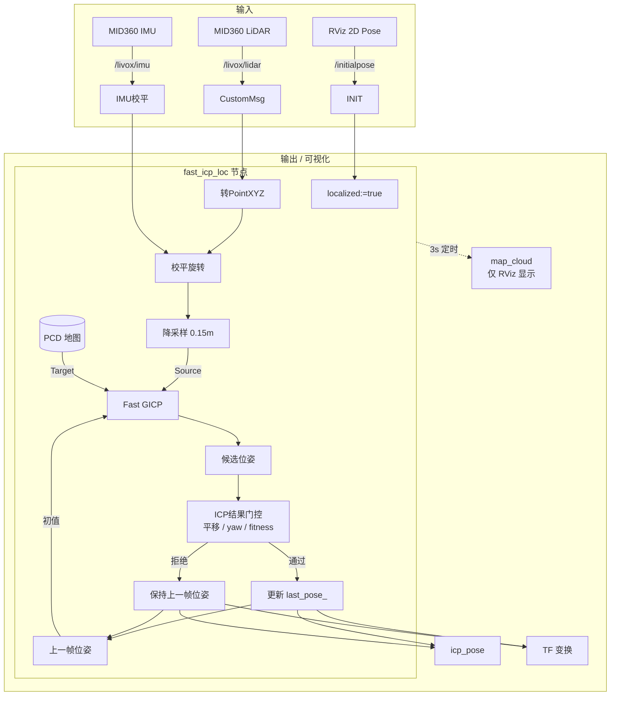

# FAST ICP 定位节点实现

> [!abstract] 定位方案
> 不用 AMCL（粒子滤波），改用 **Fast GICP**（多线程 GICP）将实时 LiDAR 扫描与预建 PCD 地图做 3D 配准，直接获取 6-DOF 位姿。

本节点属于 [[项目/多机器狗巡检|多机器狗巡检]] Phase 2（自主导航）的核心定位模块。

---

## 整体架构



---

## 关键设计决策

### 1. 无 odometry 闭环

用 ==上一帧 ICP 结果作为下一帧初始猜测==：

```
last_pose_ → 当前帧初值 → GICP → 门控验收 → 更新/保持 last_pose_ → 循环
```

首帧无 `last_pose_`，必须由用户在 RViz 用 **2D Pose Estimate** 给初始位姿。

### 2. 实时扫描校平

MID360 物理安装倾斜 ~18°，但 PCD 地图已校平（详见 [[收集箱/FASTer-LIO PCD倾斜问题排查与解决方案|校平方案]]）。

**启动时** 从 `/livox/imu` 采集 50 帧加速度计，计算校平矩阵：

```cpp
// imuCallback() — 50帧 IMU 均值
Eigen::Vector3d up = imu_acc_sum_.normalized();
Eigen::Quaterniond q = Eigen::Quaterniond::FromTwoVectors(up, Eigen::Vector3d::UnitZ());
R_level_.block<3,3>(0,0) = q.toRotationMatrix();
```

**每帧** 扫描进来先旋转再 ICP：

```cpp
// scanCallback() — 每帧应用
pcl::transformPointCloud(*scan, *scan, R_level_);
```

%%校平后 IMU 订阅自动取消 (`imu_sub_.reset()`)，不占用资源%%

### 3. CustomMsg → PointXYZ

Livox 驱动发 `livox_ros_driver2::msg::CustomMsg`（`xfer_format=1`），需手动转换：

```cpp
auto scan = pcl::make_shared<pcl::PointCloud<pcl::PointXYZ>>();
for (const auto &p : msg->points)
    scan->emplace_back(p.x, p.y, p.z);
```

### 4. 参考地图用全 3D 点云

| 切片（0.4~1.5m） | 全 3D |
|---|---|
| 丢失垂直结构 | 墙壁、柱子、门框全保留 |
| 只有水平约束 | 3D 配准更稳定 |

来自 `maps/clean/pcd_icp_latest.pcd`（经统计&半径滤波，去动态拖影）。

### 5. ICP 结果门控

Fast GICP 每帧会输出一个候选位姿，但候选位姿不直接写入 `last_pose_`。节点先比较候选位姿与上一帧位姿的差异，并检查 fitness：

| 门控项 | 含义 | 超限处理 |
|--------|------|----------|
| `max_translation_delta` | 候选位姿相对上一帧的 xy 平移跳变量 | 拒绝候选位姿 |
| `max_yaw_delta` | 候选位姿相对上一帧的 yaw 跳变量 | 拒绝候选位姿 |
| `max_fitness_score` | ICP 匹配残差评分 | 拒绝候选位姿 |

通过门控时：

```cpp
last_pose_ = candidate;
```

未通过门控或 ICP 未收敛时：

```cpp
// keeping last pose
publishPose(last_pose_);
```

这个门控的目标是防止 ICP 在几何退化、动态障碍物、初始位姿偏差或旋转过程中特征不足时，把明显跳变的错误匹配写入定位状态。

---

## 启动时序

```
t=0     节点启动，加载 PCD，开始采 IMU
t≈0.3s  "IMU leveling done: ~18 deg" — 校平完成
        等用户在 RViz 点 "2D Pose Estimate"
        ↓
        "Initial pose set" — 开始持续定位
        ↓
每帧:   CustomMsg → 校平 → 降采样 → GICP → /icp_pose + TF
        GICP候选位姿需先通过门控，否则保持上一帧位姿
```

```bash
./start_localization.sh
```

---

## RViz 调试

| 显示项 | Topic | 颜色 | 调试用途 |
|--------|-------|------|----------|
| MapCloud | `/map_cloud` | 灰色 | 确认地图加载正确 |
| LiveScan | `/livox/lidar` | 彩虹 | 确认实时扫描与地图对齐 |
| TF | — | 坐标轴 | 确认位姿输出 |

> [!bug] LiveScan 看不到彩色点？
> 1. `ros2 topic hz /livox/lidar` — 确认驱动在发数据
> 2. `ros2 run tf2_ros tf2_echo map base_link` — 确认定位 TF 在播
> 3. RViz Fixed Frame 必须是 `map`
> 4. 确认给了 `/initialpose`

---

## 坐标系

| 帧 | 来源 | 说明 |
|----|------|------|
| `map` | PCD 地图 / Nav2 | 当前定位世界坐标系 |
| `base_link` | 机器人本体 | ICP 输出的机器人位姿 |
| `livox_frame` | Livox 驱动 / 静态 TF | 雷达物理坐标系，通常由 `base_link -> livox_frame` 静态 TF 给出 |

> [!important] 地图坐标系的含义
> 建图时 FASTer-LIO 的原始参考系曾是 `camera_init`。PCD 校平（`Finish()` 中的 `gravity_rotation_`）等价于 **换了一个水平坐标系**；导航侧将这个校平后的地图参考系作为 `map` 使用。
>
> 所以这里的 `map` 实际对应 **校平后的地图坐标系**（z 朝上，xy 水平），不是 IMU 启动时的原始倾斜坐标系。

ICP 节点核心工作：==在这个校平后的 `map` 坐标系中找到 `base_link` 的位姿==。

---

## 参数

```yaml
# src/fast_icp_loc/config/fast_icp_loc.yaml
map_pcd:        "maps/clean/pcd_icp_latest.pcd"
scan_topic:     "/livox/lidar"
world_frame:    "map"
body_frame:     "base_link"
voxel_leaf:     0.25      # 降采样 (m)
max_corr_dist:  1.5       # ICP 最大对应距离 (m)
max_translation_delta: 0.45
max_yaw_delta:         0.60
max_fitness_score:    1.0
max_iterations: 15
```

---

## 性能

| 步骤 | 耗时 |
|------|------|
| CustomMsg → PointXYZ | <1 ms |
| 校平旋转 | <0.1 ms |
| VoxelGrid | ~3 ms |
| Fast GICP (4线程) | ~30 ms |
| **每帧** | **~35 ms** |

MID360 10Hz = 100ms/帧，余量 65ms。

---

## 文件清单

```
src/fast_icp_loc/
├── include/fast_icp_loc/fast_icp_loc.hpp
├── src/fast_icp_loc.cpp
├── src/fast_icp_loc_node.cpp
├── config/fast_icp_loc.yaml
├── launch/fast_icp_loc.launch.py
├── rviz/fast_icp_loc.rviz
├── CMakeLists.txt
└── package.xml
```

启动脚本：`/home/wjg/go2_nav/start_localization.sh`

## 关联

- [[项目/多机器狗巡检]]
- [[项目/多机器狗巡检-实施计划#Phase 2: 自主导航]]
- [[收集箱/FASTer-LIO PCD倾斜问题排查与解决方案]]

> [!note] 更新记录
> - 2026-07-02：创建，完成 Fast GICP 定位节点开发
> - 2026-07-17：补充 ICP 结果门控说明，并在 Mermaid 中将门控拆成独立模块
