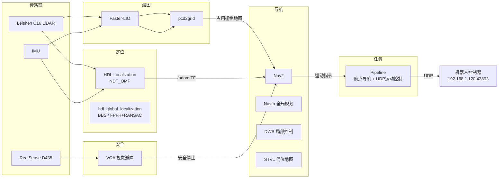

# Lite3 ROS2 自主导航环境

> [!abstract] 概述
> Deep Robotics Lite3 四足机器人的完整 ROS2 Humble 自主导航软件栈，包含 LiDAR SLAM、NDT 定位、Nav2 导航、视觉避障和任务规划。

代码路径: `~/lite_cog_ros2`

---

## 整体架构



---

## 硬件配置

| 项目 | 型号 |
|------|------|
| 机器人平台 | Deep Robotics Lite3 |
| 主控 | Jetson Orin / x86_64 |
| LiDAR | Leishen C16（16线） |
| 深度相机 | Intel RealSense D435 |
| IMU | 内置 IMU |
| ROS2 版本 | Humble (`/opt/ros/humble/`) |
| RMW | `rmw_cyclonedds_cpp` |

---

## 网络架构与 IP 分配

```
┌─────────────────────────────────────────┐
│            Lite3 机器人本体              │
│                                         │
│  ┌──────────────────┐                   │
│  │ 运控板 RK3588     │  192.168.1.120    │
│  │ (运动控制)        │                   │
│  └────────┬─────────┘                   │
│           │                             │
│  ┌────────┴─────────┐                   │
│  │ Leishen C16 LiDAR │  192.168.1.201   │
│  │ (激光雷达)        │                   │
│  └──────────────────┘                   │
│                                         │
│  ┌──────────────────┐                   │
│  │ Jetson NX (感知)  │  192.168.1.103   │
│  │ ==我们不使用==    │                   │
│  └──────────────────┘                   │
│                                         │
└─────────────────────────────────────────┘
          │
          │ 局域网
          │
┌─────────┴───────────┐
│  开发 PC (x86_64)    │  192.168.1.103   │
│  (改后占 NX 原 IP)   │                  │
└─────────────────────┘
```

| 设备 | IP | 用途 |
|------|----|------|
| 运控板 RK3588 | `192.168.1.120` | 运动控制，UDP 指令接收 (`:43893`) |
| Leishen C16 LiDAR | `192.168.1.201` | 激光雷达数据，**固定向 `103` 发送点云** |
| Jetson NX | `192.168.1.103` | 原厂感知上位机，==我们不使用== |
| 开发 PC | `192.168.1.103` | 替换 NX，接收 LiDAR 数据 |

> [!important] LiDAR 数据流
> Leishen C16 激光雷达**固定向 `192.168.1.103` 发送点云数据**，不响应目标 IP 配置修改。
> 因此方案是：==把 Jetson NX 下线，将开发 PC 的 IP 改为 `192.168.1.103`==，直接接收 LiDAR 数据。

## 软件模块

共 ==11 个模块==分属 8 个独立 colcon workspace：

| 模块 | 路径 | 算法 | 说明 |
|------|------|------|------|
| **建图** | `slam/` | Faster-LIO (FastLIO2 + ivox3d) | 紧耦合 LiDAR-惯性里程计 |
| **地图转换** | `slam/pcd2grid` | — | PCD → 占用栅格地图 |
| **定位** | `nav/hdl_localization` | NDT_OMP + IMU 预测 | 3D LiDAR scan-to-map |
| **全局重定位** | `nav/hdl_global_localization` | BBS / FPFH+RANSAC | 无初值全局定位（==当前关闭==） |
| **导航** | `nav/dr_nav2` | Navfn + DWB + STVL | Nav2 配置与启动 |
| **配准加速** | `ndt_omp/` | NDT_OMP / GICP_OMP | OpenMP 并行加速 |
| **避障** | `voa/` | 点云 + Grid Map | 视觉障碍物检测与安全停止 |
| **任务规划** | `pipeline/` | 纯 Python | 航点导航 + UDP 运动指令 |
| **驱动-雷神** | `driver/leishen_ws/` | — | Leishen C16 LiDAR 驱动 |
| **驱动-RealSense** | `driver/rl_ws/` | — | RealSense D435 驱动 |
| **传感器桥接** | `transfer/` | — | Jetson ↔ 机器人控制器 |

---

## 关键配置

### Faster-LIO 建图参数

```yaml
lid_topic: "/rslidar_points"
imu_topic: "/imu/data"
lidar_type: 4          # C16 Leishen
scan_line: 16
ivox_grid_resolution: 0.5
max_iteration: 3
extrinsic_T: [0.075, 0.0, 0.023]
blind: 4.0             # 盲区 (m)
fov_degree: 180
det_range: 150.0       # 探测距离 (m)
```

### NDT 定位参数

```yaml
reg_method: "NDT_OMP"
ndt_resolution: 1.0
ndt_neighbor_search_method: "DIRECT7"
transformation_epsilon: 0.01
globalmap_pcd: "system/map/lite3.pcd"
```

> [!warning] NDT_CUDA 不可用
> 当前 x86 机器无 NVIDIA GPU，NDT_CUDA 分支已被禁用。详见 [[#已知问题]]。

### Nav2 导航参数

| 组件 | 算法 | 频率 |
|------|------|------|
| 全局规划 | Navfn (Dijkstra) | 5 Hz |
| 局部控制 | DWB | 5 Hz |
| 代价地图 | STVL + Inflation | — |
| 恢复行为 | Spin / BackUp / Wait | — |

### VOA 避障参数

```yaml
passage_zone: [3.0, 3.0]     # 通行区域 (m)
robot_size: [0.65, 0.45]     # 机器人尺寸 (m)
obstacle_height_threshold: 0.10  # 障碍物高度阈值 (m)
```

---

## 编译顺序

> [!info] 编译前
> `source /opt/ros/humble/setup.bash`

```bash
# 1. ndt_omp （无 ROS2 依赖）
cd ndt_omp && colcon build --symlink-install

# 2. nav （依赖 ndt_omp + fast_gicp）
cd nav && source ../ndt_omp/install/setup.bash && colcon build --symlink-install

# 3. slam （独立）
cd slam && colcon build --symlink-install

# 4. 其余 workspace
cd transfer && colcon build --symlink-install
cd voa && colcon build --symlink-install
```

---

## 启动流程

```bash
# === 传感器驱动 ===
bash system/scripts/lidar/start_lslidar.sh               # Leishen C16
bash system/scripts/depth_camera/realsense/start_realsense.sh  # RealSense

# === 建图模式 ===
bash system/scripts/slam/start_slam.sh                    # Faster-LIO + pcd2grid

# === 已建图导航模式 ===
bash system/scripts/nav/start_nav.sh                      # HDL Localization + Nav2
bash system/scripts/voa/start_voa.sh                      # 避障
bash system/scripts/transfer/start_transfer.sh            # 传感器桥接
```

---

## 坐标系关系

```
map → odom → base_link → lidar/imu/camera
      ↑                    ↑
   NDT定位修正         TF静态外参
```

- ==map ← odom== : NDT 定位发布的修正变换（高频 drift 修正）
- ==odom ← base_link== : 机器人里程计
- ==base_link ← lidar== : 静态 TF `[0.075, 0.0, 0.023]`

> [!note] 坐标系细节
> 建图阶段 Faster-LIO 同时输出 odom → base_link 和 map → odom，保存地图后 NDT 定位替代 Faster-LIO 提供 map → odom 修正。

---

## 已知问题

> [!bug] 全局重定位不可用
> `use_global_localization: False`，且 `system/map/` 目录为空（无 `lite3.pcd` 地图文件）。

> [!bug] NDT_CUDA 被禁用
> 当前 x86 机器无 NVIDIA GPU，编译时已跳过 CUDA 分支。

> [!failure] VOA 运行时缺库
> `libgrid_map_ros.so` 等未安装，需 `ros-humble-grid-map` 系列包。

> [!warning] STVL 未安装
> `ros-humble-spatio-temporal-voxel-layer` 未安装，影响 Nav2 代价地图。

> [!info] Livox Mid360 驱动缺失
> `driver/mid360_ws/` 不存在，仅支持 Leishen C16。

> [!info] pcl_ros 兼容性修复
> `pcl_ros/point_cloud.hpp` 与 GCC 12 不兼容，已通过 `nav/src/hdl_localization/include/pcl_ros_fix.hpp` 本地修复。详见源码。

---

## 相关笔记

- [[FAST ICP 定位节点实现]] — 另一套 Fast GICP 定位方案（Mid360 版本）
- [[Nav2 自主导航部署]] — Nav2 通用部署指南
- [[FASTer-LIO PCD倾斜问题排查与解决方案]] — 建图故障排查
