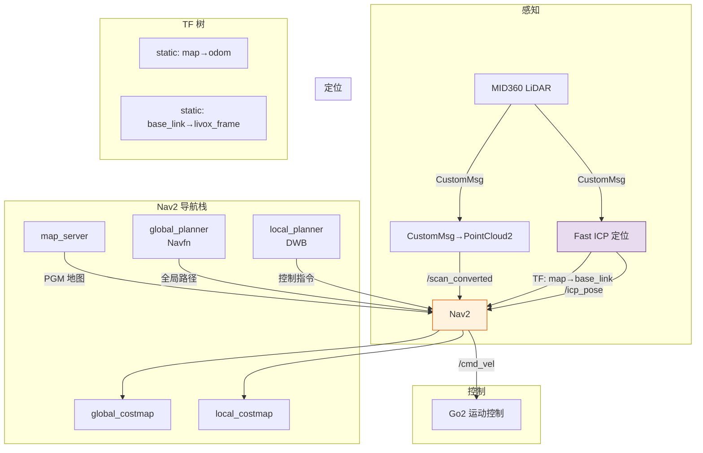

# Nav2 自主导航部署

> [!abstract]
> 在 FAST ICP 定位基础上，部署 Nav2 导航栈实现自主导航。全局规划 + 局部控制 + 实时避障。

属于 [[项目/多机器狗巡检|多机器狗巡检]] Phase 2（自主导航）。定位模块见 [[收集箱/FAST ICP 定位节点实现]]。

---

## 架构



---

## 文件清单

| 文件 | 作用 |
|------|------|
| `nav2_config/nav2_params.yaml` | Nav2 全部参数配置 |
| `start_navigation.sh` | 一键启动脚本 |

---

## 参数配置

### nav2_params.yaml

```yaml
# ===== 代价地图 =====
global_costmap:
  global_frame: map
  static_map: true                    # 加载 PGM 作为静态地图
  plugins: ["static_layer", "obstacle_layer", "inflation_layer"]

local_costmap:
  global_frame: odom
  rolling_window: true                # 跟随机器人移动
  width: 5.0
  height: 5.0
  plugins: ["voxel_layer", "inflation_layer"]

# ===== 障碍物观测（共用一个 topic）=====
obstacle_layer / voxel_layer:
  observation_sources: lidar
  lidar:
    topic: /scan_converted            # ICP 节点发布的 PointCloud2
    sensor_frame: livox_frame
    data_type: "PointCloud2"

# ===== 规划与控制 =====
planner: GridBased → NavfnPlanner

controller: FollowPath → DWBLocalPlanner
  max_vel_x: 1.0
  max_vel_theta: 1.0
  xy_goal_tolerance: 0.15
  yaw_goal_tolerance: 0.15
```

### Go2 运动参数

| 参数 | 值 | 说明 |
|------|-----|------|
| `max_vel_x` | 1.0 m/s | 最大前进速度 |
| `max_vel_theta` | 1.0 rad/s | 最大转向速度 |
| `inflation_radius` | 0.5 m | 障碍物膨胀半径 |
| `footprint` | — | Go2 身形 ~0.7×0.4m |

---

## TF 树

```
map      → 静态(identity) → odom
map      → ICP             → base_link
base_link → 静态(x=0,y=0,z=0.3) → livox_frame
```

- `map→odom`：静态 identity（ICP 定位直接输出 map→base_link，不需要独立 odom frame）
- `map→base_link`：由 FAST ICP 节点每帧更新
- `base_link→livox_frame`：LiDAR 在机器人上的安装位置（z=0.3 代表 MID360 在狗背上）

---

## 关键问题

### 1. CustomMsg → PointCloud2 转换

Livox 驱动用 `xfer_format=1`，发 `CustomMsg`（含点时间戳、反射率），Nav2 costmap 障碍物层只认 `PointCloud2` 或 `LaserScan`。

**方案**：在 ICP 节点（`fast_icp_loc.cpp`）的 `scanCallback` 中，CustomMsg→PointXYZ 转换后，立即 `pcl::toROSMsg` 发布为 PointCloud2：

```cpp
sensor_msgs::msg::PointCloud2 scan_msg;
pcl::toROSMsg(*scan, scan_msg);
scan_msg.header.frame_id = "livox_frame";
scan_pub_->publish(scan_msg);          // → /scan_converted
```

Nav2 的 `obstacle_layer` 和 `voxel_layer` 均订阅 `/scan_converted`。

### 2. 无 AMCL

使用 [[收集箱/FAST ICP 定位节点实现|Fast ICP 定位]] 替代 AMCL：发布 `map→base_link` TF，Nav2 直接使用。

### 3. map → odom 不独立

无轮式里程计，`map→odom` 使用静态 identity TF。ICP 定位不依赖 odom frame。

---

## 启动

```bash
./start_navigation.sh
```

### 启动时序

```
        Livox MID360 驱动
        ↓
        Static TF (map→odom, base_link→livox_frame)
        ↓
        Fast ICP 定位（等待 IMU 校平 + /initialpose）
        ↓
        Nav2（map_server → planner → controller）
        ↓
        RViz2
```

### RViz 操作

1. **2D Pose Estimate** — 在地图上点初始位置
2. **Nav2 Goal** — 下发目标点

---

## 性能

| 模块 | 频率 | 占用 |
|------|------|------|
| Fast ICP 定位 | 10Hz | ~35ms/帧 |
| global_costmap | 2Hz | — |
| local_costmap | 5Hz | — |
| planner | 1Hz | — |
| controller (DWB) | ~20Hz | — |

---

## 调试

```bash
# 检查 TF 树
ros2 run tf2_tools view_frames

# 检查定位是否稳定
ros2 topic echo /icp_pose --once

# 检查 Nav2 节点状态
ros2 lifecycle list /map_server /planner_server /controller_server

# 检查 costmap 可视化
# 在 RViz 中添加 Map 显示 /move_base/global_costmap/costmap
# 和 /move_base/local_costmap/costmap

# 如果导航卡住不动
# 检查 /cmd_vel 是否有输出
ros2 topic echo /cmd_vel
```

---

## Nav2 相关笔记

- [[收集箱/FAST ICP 定位节点实现]] — ICP 定位模块
- [[收集箱/FASTer-LIO PCD倾斜问题排查与解决方案]] — PCD 校平
- [[项目/多机器狗巡检-实施计划#Phase 2: 自主导航]]

> [!note] 更新记录
> - 2026-07-02：创建，完成 Nav2 基础配置
