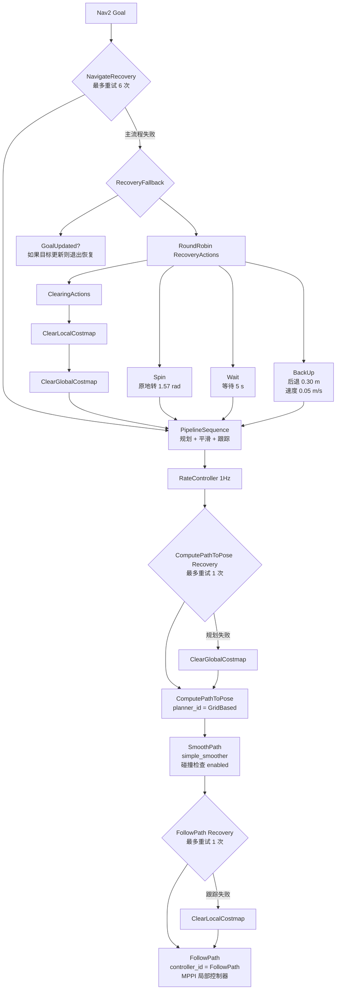

# 2026-07-15 工作日记

> Go2 + MID360 + FAST ICP + Nav2 实机导航调试。核心结论：卡顿不是单一问题，既有 Go2 低速执行死区，也有全局路径贴障碍物导致 MPPI 沿高代价边缘跟踪的问题。当前方案是引入 `go2_cmd_adapter` 处理 `/cmd_vel` 执行适配，同时调整 costmap / SmacPlanner 参数让路径更远离障碍物。

---

## 一、当前行为树

来源：`/home/wjg/go2_nav/nav2_config/navigate_to_pose_w_smoothing.xml`



简单理解：

- `ComputePathToPose`：全局规划，负责画路线。
- `SmoothPath`：把全局路线平滑一下。
- `FollowPath`：局部控制器，真正生成 `/cmd_vel`。
- `FollowPath` 失败后，先清 `local_costmap` 再试一次。
- 整体导航失败后，进入恢复策略：清局部/全局 costmap、原地转、等待、后退，然后重新规划和跟踪。

恢复策略不是一看到障碍物就触发，而是 planner/controller 返回失败后才触发。Nav2 基础部署记录见 [[收集箱/Nav2 自主导航部署]]。

---

## 二、当前 git 状态

仓库：`/home/wjg/go2_nav`

当前分支：`master`

已提交并推送的最新提交：

```text
6af5b9f Stabilize ICP localization and dynamic obstacle planning
```

这次提交做了：

- 给 `fast_icp_loc` 增加 ICP 门控，避免 TF 大跳变。
- 给 `global_costmap` 增加 `/scan_leveled` 障碍物输入，让动态障碍也能参与全局规划。
- 调整 Nav2 参数，让机器狗运动更稳。
- 已编译并推送到 `origin/master`。

当前未提交修改：

- `nav2_config/nav2_params.yaml`
- `src/go2_bridge/go2_bridge/bridge.py`
- `src/go2_bridge/go2_bridge/cmd_adapter.py`
- `src/go2_bridge/setup.py`
- `start_navigation.sh`
- `CHANGELOG_NAV.md`

仓库内修改记录同步维护在：`/home/wjg/go2_nav/CHANGELOG_NAV.md`。

---

## 三、问题演进

### 1. 不是 Nav2 完全没给速度

一开始现象是：前方有障碍物时，机器狗会停住或卡住。

后来查看 `/cmd_vel`，发现 Nav2 其实有发速度，例如：

```yaml
linear.x: 0.14 ~ 0.15
linear.y: 0.05 ~ 0.06
angular.z: 接近 0
```

所以问题不完全是“Nav2 没规划/没控制”，而是：速度太小的时候，Go2 sport `MOVE` 接口可能没有真正迈步。

### 2. bridge 内低速补偿有副作用

曾经在 `go2_bridge` 里直接做过低速补偿：

- 对 x/y 平面速度计算合速度 `hypot(vx, vy)`。
- 如果合速度太小，就按比例放大到最小执行速度。
- 后来还尝试过单独给侧向 y 加最小速度。

这些方案的问题：

- 合速度补偿虽然保持 x/y 比例，但会把掉头或微调时的小平移噪声也放大。
- 单独放大 y 会直接破坏 Nav2 的运动方向，导致横向动作异常。
- 机器狗可能出现掉头带横移、绕障姿态怪、低速颤抖等问题。

结论：

- `go2_bridge` 不应该承担复杂速度策略。
- `go2_bridge` 只负责 Twist → Go2 sport API。
- Go2 执行适配应放到独立 adapter 中，方便调试和回退。

---

## 四、当前方案：go2_cmd_adapter

现在新增独立 adapter：

```text
Nav2 /cmd_vel
   ↓
go2_cmd_adapter
   ↓
/cmd_vel_go2
   ↓
go2_bridge
   ↓
/api/sport/request
```

对应文件：

- `/home/wjg/go2_nav/src/go2_bridge/go2_bridge/cmd_adapter.py`
- `/home/wjg/go2_nav/src/go2_bridge/go2_bridge/bridge.py`
- `/home/wjg/go2_nav/src/go2_bridge/setup.py`
- `/home/wjg/go2_nav/start_navigation.sh`

启动脚本现在会先启动：

```bash
ros2 run go2_bridge go2_cmd_adapter
```

再启动：

```bash
ros2 run go2_bridge go2_bridge
```

`go2_bridge` 默认订阅：

```text
/cmd_vel_go2
```

它只负责最大速度限幅和 Go2 `MOVE` API 发布。

### adapter 当前规则

#### 原地转优先

```text
abs(wz) >= 0.25
hypot(vx, vy) < 0.16
```

满足时清掉 `vx/vy`，只保留 `wz`。目的是避免机器狗掉头时被很小的 x/y 分量带出横向漂移。

#### 平移太小直接置零

```text
hypot(vx, vy) < 0.08
```

直接把 `vx/vy` 置零，避免 Go2 因小速度反复尝试执行而颤抖。

#### 平移偏小但确实要动时，有限补偿

```text
hypot(vx, vy) < 0.22
max_boost_ratio = 1.9
```

保持 x/y 比例，只放大合速度，不单独放大 y。这样尽量越过 Go2 低速执行死区，同时不破坏 Nav2 规划出来的方向。

#### 加速度限制

```text
planar max accel = 0.8 m/s^2
yaw max accel = 1.5 rad/s^2
```

目的是避免速度突变造成动作不稳。

---

## 五、主要新判断：路径贴障碍物才是卡顿核心之一

后面发现，机器狗卡顿不只是 Go2 执行层问题。

关键现象：

- 全局路径有时贴着障碍物边缘。
- 机器狗沿着障碍物边走一个弧线。
- 这个弧线速度对 Go2 来说很别扭。
- MPPI 被迫沿高代价区域跟踪，速度会犹豫、变小或抖动。

结论：

- adapter 只能改善执行层。
- 如果全局路径本身贴障碍物，局部控制器还是会难受。
- 所以需要让全局路径和局部代价场都更远离障碍物。

这部分和 [[项目/多机器狗巡检]] 中 Go2 已知地图导航目标直接相关，也会影响后续 [[项目/机器狗多楼层建图导航方案]] 中的长期稳定巡检能力。

---

## 六、路径远离障碍物优化

文件：`/home/wjg/go2_nav/nav2_config/nav2_params.yaml`

### MPPI 更讨厌靠近障碍物

```text
CostCritic.cost_weight: 24.0 -> 32.0
```

作用：MPPI 更讨厌靠近障碍物。

### local costmap 代价范围变宽

```text
local inflation_radius: 0.55 -> 0.65
local cost_scaling_factor: 3.5 -> 2.8
```

作用：local costmap 的代价范围变宽，代价衰减更慢，让局部控制器提前感受到障碍物边缘。

### global costmap 更强地推开路径

```text
global inflation_radius: 0.70 -> 0.95
global cost_scaling_factor: 3.0 -> 2.2
```

作用：global costmap 更强地把全局路径推离障碍物。

### SmacPlanner2D 更偏向低代价区域

```text
cost_travel_multiplier: 2.0 -> 4.0
```

作用：SmacPlanner2D 更偏向低代价区域，不要贴着障碍物边走。

预期效果：

- 全局路径离障碍物更远。
- 弧线更松，不贴边。
- MPPI 不需要沿障碍物边缘硬跟踪。
- 绕障时速度更自然，卡顿减少。

可能副作用：

- 路径会更保守。
- 狭窄通道可能更难通过。
- 如果绕得太远，优先把 `global inflation_radius` 从 `0.95` 降到 `0.85`。

---

## 七、定位与 IMU 闭环思路

当前定位链路基于 [[收集箱/FAST ICP 定位节点实现]]，MID360 驱动和 IMU 来源见 [[收集箱/Livox Mid-360 激光雷达部署]]。早期 IMU 校平和点云坐标系问题见 [[2026-07-04]]。

Livox IMU 可以提供角速度和线加速度，但不能直接提供长期可靠的侧向速度。

原因：

- 单独积分 IMU 加速度会漂移。
- 机器狗身体晃动、地面不平、雷达安装不平都会影响加速度。
- ICP 定位不适合作为高速闭环速度来源，因为它可能延迟、跳变或短时失配。

更合理的闭环来源：

- Go2 自身 odom。
- Faster-LIO 前端 odom。
- `robot_localization` 融合后的 odom。

FASTer-LIO 地图校平相关问题见 [[收集箱/FASTer-LIO PCD倾斜问题排查与解决方案]]。

后续如果要做真正闭环，可以让 `go2_cmd_adapter` 同时订阅 odom：

```text
Nav2 期望速度不为 0
实际 odom 速度接近 0
持续一小段时间
```

这时 adapter 再小幅修正输出，而不是一开始固定放大。

---

## 八、验证记录

已执行过：

```bash
python3 -m py_compile src/go2_bridge/go2_bridge/bridge.py src/go2_bridge/go2_bridge/cmd_adapter.py
python3 -c "import yaml; yaml.safe_load(open('nav2_config/nav2_params.yaml')); print('yaml ok')"
colcon build --packages-select go2_bridge --symlink-install --event-handlers console_direct+
```

当前这些修改还未提交 git。

---

## 九、下一步测试重点

重启：

```bash
./start_navigation.sh
```

观察：

```bash
ros2 topic echo /cmd_vel
ros2 topic echo /cmd_vel_go2
ros2 topic echo /api/sport/request
```

重点判断：

- `/cmd_vel_go2` 是否保留了 `/cmd_vel` 的运动方向。
- 原地转时是否清掉了小的 x/y。
- 绕障路径是否比之前离障碍物更远。
- 如果路径过于保守，先调 global inflation，而不是继续改 adapter。

## 关联

- [[2026-07-04]]
- [[项目/多机器狗巡检]]
- [[项目/机器狗多楼层建图导航方案]]
- [[收集箱/Nav2 自主导航部署]]
- [[收集箱/FAST ICP 定位节点实现]]
- [[收集箱/Livox Mid-360 激光雷达部署]]
- [[收集箱/FASTer-LIO PCD倾斜问题排查与解决方案]]
