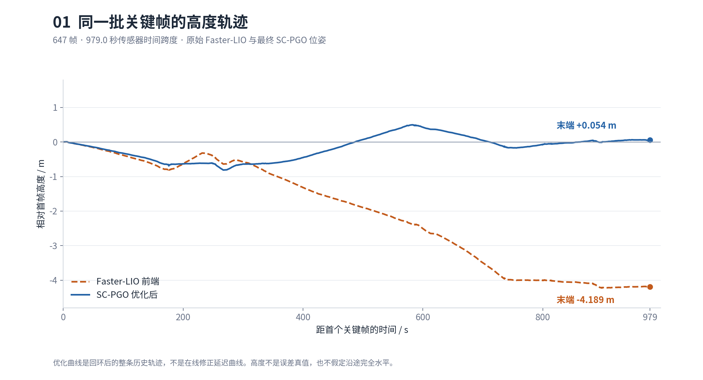
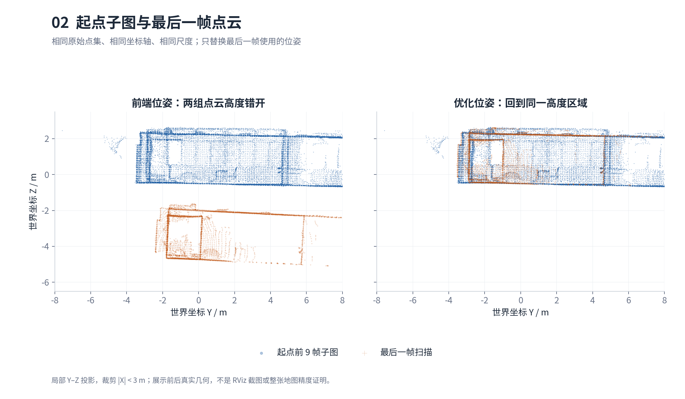
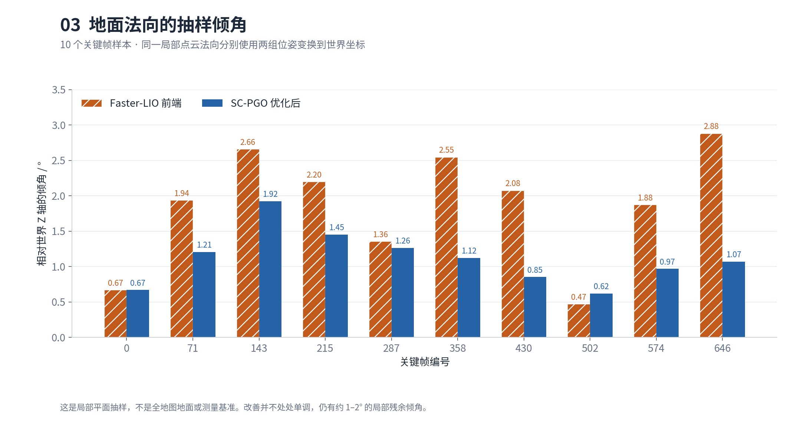
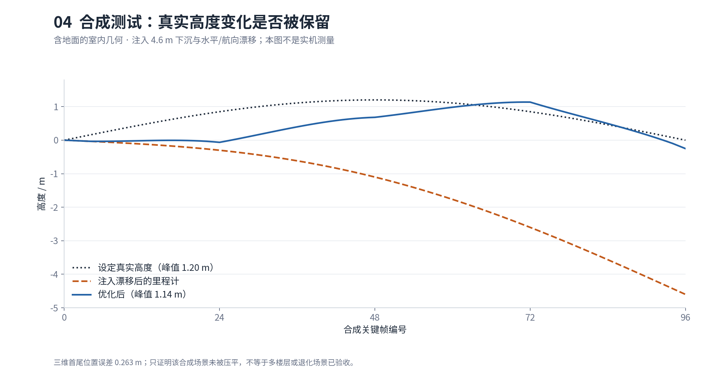

# D1 Max 建图技术日记：从外参审计到大回环高度漂移修复

今天的工作围绕一个目标展开：为后续楼层地图管理和导航，建立一条**输入可追溯、坐标关系明确、回环结果可以验收**的建图链路。工作从传感器外参核查和原始数据采集开始，经过 MOLA 原生 LIO 试用，最终集中解决 Faster-LIO + SC-PGO 在大范围闭环路线中“越走越低、末尾接不上起点”的问题。

最终在同一批 647 个真实关键帧上，后端接受了包括返回起点在内的 6 条回环约束。相对于独立点云配准测量的首尾位置误差，由 **4.431 m 降到 0.147 m**；首尾世界坐标高度差由 **−4.189 m 变为 +0.054 m**。这表明本次大回环修正有效，**不等于前端漂移根因全部消除，也不等于整张地图达到 15 cm 绝对精度**。

## 一、先把数据和标定关系弄清楚

### 1.1 外参不是“找到一组厂家参数”就能直接使用

当天核查发现，系统中同时存在雷达 DIFOP、厂家 localization 默认参数、机器人 OTA 标定文件，以及 PC 项目中的历史转换。它们的来源和用途不同，不能混成同一套标定。

| 来源 | 今天确认的事实 | 对工程接入的含义 |
|---|---|---|
| 每颗雷达的 DIFOP | 前后雷达分别有自己的雷达—内置 IMU 参数，四元数模长正常 | 必须按设备及变换方向核验；不是双雷达之间的外参 |
| 厂家 localization 参数接口 | 查询仍可能返回默认双雷达值 | 参数接口返回值不一定等于内部最终生效值 |
| OTA 标定文件及厂家启动日志 | 日志确认部分默认值被 OTA 覆盖；部分旋转矩阵未通过正交性检查 | “已加载”不能替代“数学合法、方向正确、精度已验证” |
| PC 上的建图与定位配置 | 保留历史点云转换和 IMU 转轴，尚未与本机全部标定统一 | 不能把历史配置称为已核验的整机出厂标定 |

一个具体异常是：默认雷达—IMU 旋转矩阵中的 `0.01236809`，在 OTA 对应字段中为 `0.001236809`，使该矩阵的 `‖RᵀR−I‖F ≈ 0.0157415`。这不是足以忽略的显示精度差异，但也不能据此擅自改一个数字或自动正交化后就宣称完成标定。IMU—机身矩阵同样存在合法性和方向核对问题。

当前 PC 启动路径还包含两层容易混淆的处理：适配器先转换点云坐标、将 IMU 按 `(x,y,z) → (x,−z,y)` 转轴；`mapping.launch.py` 再覆盖 Faster-LIO 的内部外参为 `R=I、t=0`，并关闭在线外参估计。因此，**只查看基础 YAML 中的外参数字，并不能得到真实启动配置**。内部单位外参表达的是“适配器已经完成对齐”的假设，不代表物理传感器不需要标定。

这一天的修复没有更换这些物理外参。外参审计作为独立问题保留，避免同时修改标定、滤波器和回环逻辑，使改善来源无法区分。

### 1.2 原始 bag 与算法输入分开管理

Web 的录制管理模块采用独立的 `backend/bags/` 和录制 YAML：只有点击录制才启动检查与录制进程；停止时优先正常落盘，互斥锁及进程身份校验防止重复执行或误杀其他任务。地图、录制包的显示名称和归档状态独立保存，不通过重命名原始目录实现管理。

本次使用的包为 `slam_raw_20260917_171716_fe8f38`。任务记录为 17:17:16 启动、17:33:43 正常停止，bag 元数据时长 **984.989 s**，共 **685,529 条消息、3 个 SQLite 分片**，数据文件约 42.08 GB（十进制）。以下数量以落盘后的 `metadata.yaml` 为准，而不是界面瞬时频率。

| 数据 | 实际消息数 | 本次 Faster-LIO 是否使用 |
|---|---:|---|
| `/front_lidar` | 9,364 | 是 |
| `/rear_lidar` | 9,325 | 是 |
| `/front_lidar/imu` | 189,626 | 是 |
| `/rear_lidar/imu` | 190,011 | 否，保留用于后续核查 |
| `/imu_driver/imu_central` | 192,971 | 否，机身独立 IMU 已录制但未接入本轮 LIO |
| `/tf`、`/tf_static` | 47,098 / 47,134 | 不回放厂家 TF，避免混入另一套坐标链 |

本包没有 MC 里程计、图像和厂家 localization odom；管理页面具备可选项，不等于这次实际录到了这些数据。也不能根据该包宣称已经验证 SDK 高频速度或三 IMU 融合。

录制阶段保留消息数值、时间戳、frame 和逐点字段。IMU 的单位转换属于后续算法适配：当前原始前雷达 IMU 加速度按 g 输入，由适配器转换到 SI，必须只做一次。MOLA 的 `input_si_front` 是独立转换副本，不能再当成原始包送入同样执行 g→m/s² 的 Faster-LIO 适配器。

## 二、先固定实验条件，再分析“走着走着下沉”

MOLA 原生试验使用前雷达、前雷达 IMU 和官方 GICP 流水线中的 IMU 处理，没有启用回环，使用自带可视化。用户反馈有倾斜现象后转向 Faster-LIO + SC-PGO；该 MOLA 运行最终标记为 `interrupted`。它既没有完整验收，又与后续双雷达方案输入不同，不能据此给出“MOLA 一定不如 Faster-LIO”的定量结论。

早期 Faster-LIO 试跑也暴露了实验管理问题：18:17、18:19 的记录使用了 CycloneDDS 和前单雷达，分别失败或中断，**没有遵守既定 Zenoh 通信约束**；18:26 虽恢复 Zenoh，仍是前单雷达。这些记录保留，但不作为最终方案的有效对照。后续固定 **`rmw_zenoh_cpp`、前后双雷达、前雷达 IMU、隔离 Domain 217、原始 bag 只读**，禁止故障时自动更换中间件或静默改成单雷达。

| 阶段 | 输入与执行范围 | 结果及用途 |
|---|---|---|
| 17:53 MOLA 原生 LIO | 前雷达 + 前 IMU，无回环 | 中断；仅作为问题背景，不纳入公平性能比较 |
| 18:17—18:26 早期试跑 | 中间件/雷达模式不一致，未跑完整 | 暴露流程问题；不作为验收基线 |
| 18:28 双雷达 Zenoh 基线 | 完整原始包回放 | 647 关键帧，接受回环 0 条，末端 Z 差 −4.603 m |
| 19:01 初始化及第一版回环修改 | 完整前端回放并保存 body 关键帧 | 647 关键帧，仅接受 2 条小回环，大回环仍未接上 |
| 最终后端复验 | 复用上述 647 帧与原始里程计 | 接受 6 条约束，含关键的 `0 ↔ 642`，独立几何验收通过 |

在正式基线中，7 个候选进入 ICP 后全部被 `fitness` 检查拒绝，`optimized_poses.txt` 与 `odom_poses.txt` 相同。也就是说，问题至少包含两个层次：**前端确实累计了高度/姿态漂移；后端虽然在运行，却没有提供有效回环校正**。仅看到文件名 `optimized_map.pcd` 或保存成功，不能判定回环成功。



图 1 使用 19:01 这次前端回放的同一批位姿与最终后端位姿。基线的 −4.603 m 和图中的 −4.189 m 属于不同运行，初始化参考系也有变化，不能把两者差值单独归功于某项参数。图中的蓝线是回环后重新优化的历史轨迹，不是实时滤波器从一开始就具有同样精度的证明。

## 三、前端修复：稳定初始化与一致的世界坐标

首先增加了独立的 `StationaryInitialization` 模块。建图配置要求至少 300 个样本、持续约 2 s，并检查有限值、断流、加速度离散程度、角速度离散程度和平均角速度。本次实际用到 400 个样本；日志记录的平均加速度为 `[0.0278595, −0.160367, 9.82863] m/s²`，陀螺仪零偏初始化为 `[−0.00558931, −0.00245677, −0.00747816] rad/s`。

该检查用于避免明显运动或不完整窗口参与启动估计，但低方差 IMU 无法区分静止与匀速运动，采集和初始化时仍应保持机器人静止。模块默认不开启，由建图 YAML 显式启用；已有定位分支没有被自动切换到这套参数。

其次，将“保存时旋转 PCD”改为在这个建图分支中**从初始状态建立一致的 Z-up 世界坐标**：初始姿态对齐 IMU 测得的向上方向，初始重力写入世界负 Z；第一帧插入地图时也应用同一状态变换。点云、轨迹与 TF 使用相同坐标约定，导出阶段避免重复旋转。

这与知识库中 [MID360 的历史整体校平笔记](<../收集箱/FASTer-LIO PCD倾斜问题排查与解决方案.md>) 不是同一个问题。那篇记录着重处理整体坐标倾斜；今天处理的是沿路线累积的非刚性轨迹误差。对整张 PCD 做一次刚体旋转，可以改变整体朝向，却不能修复不同路段之间已经形成的相对错位。历史笔记保留，但其中经验不能直接推广成“任何修改初始状态都会失败”或“剩余倾角一定不影响导航”。

运行过程中原有 LIO 的姿态、零偏和重力状态估计仍然保留，没有锁 Z，也没有添加“所有地面都处于同一高度”的约束。新的前端结果仍有明显下沉，说明**初始化改进不能替代后端闭环，更不能单独视为前端漂移根因已解决**。

## 四、后端修复：让返回起点成为真正的几何约束

### 4.1 候选检索与回环成立是两件事

原来的配准从有漂移的全局坐标出发，没有充分使用 ScanContext 返回的 yaw。面对数米高度误差、朝向差和局部可见性变化，ICP 容易落入错误初值或被评分门限拒绝。

现在优先使用合格的 ScanContext 候选；检索没有合格结果时，再补充满足时间间隔、关键帧间隔及空间范围的历史邻近候选。描述子计算可以去掉 roll/pitch 的影响，但用于实际配准和建图的 3D 点云不压平。空间邻近只提供“值得验证”的假设，不直接产生回环边。

### 4.2 在历史局部坐标中做完整六自由度配准

几何验证独立为 `loop_registration` 模块：源是当前 body 点云，目标是历史关键帧附近的局部子图。保留里程计预测、ScanContext 朝向及重新居中的多个初值，先粗配准、再细配准。单位测试检查了 ScanContext yaw 的符号约定，避免把“历史对当前”的旋转直接反用到“当前点云变换到历史坐标”。

修复后的关键配置如下。搜索/校正范围和几何质量门限是不同概念：扩大允许恢复的漂移范围，并不意味着直接接受大位移回环。

| 配置 | 本次值 | 含义 |
|---|---:|---|
| 粗 / 细体素 | 0.40 / 0.20 m | 两级配准的空间分辨率 |
| 粗 / 细最大对应距离 | 2.0 / 1.0 m | ICP 搜索对应点的范围 |
| 覆盖率评价距离 | 0.35 m | 判断匹配内点的距离门限 |
| 正向 / 反向最低覆盖 | 0.65 / 0.35 | 同时限制单帧和子图之间的覆盖情况 |
| 最大内点均方残差 | 0.03 m² | 与米制 RMSE 区分，不能混用 |
| 总位置 / 垂直校正上限 | 10 / 6 m | 允许恢复米级漂移，仍需所有几何检查通过 |
| 相邻几何校正一致性 | 0.60 m / 0.06 rad | 不仅描述子连续，还要求独立配准变换一致 |

旧垂直校正上限 0.30 m 也不足以恢复本次米级下沉，但基线的实际拒绝日志发生在更早的 `fitness` 阶段，不能把所有失败都解释为这个上限。

对通过基本几何检查的候选，还要限制姿态、倾角和历史—当前真实相对位移，并要求相邻扫描得到一致校正，再加入带鲁棒核的位姿图。最终 `0 ↔ 642` 的日志记录：正向覆盖约 74.8%、反向覆盖约 36.3%、内点 MSE 约 0.02442 m²、垂直校正约 +4.162 m。这个日志是后端内部核验结果，与后文独立 Open3D 检查的覆盖率不是同一指标。

### 4.3 修复调度和优化后的状态连续性

还修复了两个会使“算法有能力配准，但运行时仍漏掉结果”的问题。

第一，配准繁忙、候选队列满时，旧行为可能丢掉最新扫描，恰好漏掉真正返回起点的末端候选。现在保留最新候选、淘汰最旧候选，并记录 `candidate_superseded`。这属于时效性修复，不是绕过几何核验。

第二，新关键帧不能在回环优化后直接回到原始漂移坐标。令 `Tᵐ_b` 表示优化后的 body→map 位姿，`Tᵒ_b` 表示前端 body→odom 位姿，则当前校正为：

```text
Tᵐ_o = Tᵐ_b · (Tᵒ_b)⁻¹
新关键帧初值：Tᵐ_b,new = Tᵐ_o · Tᵒ_b,new
```

原始里程计边不改写；后端用回环边重新优化历史关键帧，并按优化位姿重建地图。它既不是只移动最后一帧，也不是把整张地图统一抬高 4 m。



图 2 的蓝色为起点前 9 帧子图，橙色为最后一帧扫描。两幅图使用同样的原始数据来源、坐标尺度和空间裁剪，仅更换末帧使用的位姿。它直接显示高度错位被纠正，而不是依靠更换视角或色带制造“看起来更平”的效果；局部投影仍不能替代全图检查。

## 五、验收：闭环成功必须有独立的几何证据

### 5.1 为什么不能直接要求终点等于起点？

机器人返回同一场景，不代表传感器最后一帧与第一帧停在完全相同位置和朝向。因此不能把 `‖p_end−p_start‖` 直接定义为定位误差，也不能强行把终点拉到原点。

独立检查采用另一套 Open3D 点到平面配准：最后一帧原始 body 点云匹配起点前 9 帧构成的小子图，子图仅使用原始早期相对里程计。配准分别试用前端/后端相对姿态作为朝向初值，但平移初值归零，不把优化后高度直接当作测量结果。它独立于后端的 PCL 配准实现，**仍与后端共享原始点云，不是外部真值**。

以此获得相对变换 `T_match`，分别比较前端及后端首尾相对位姿：

```text
T_est = (T_first)⁻¹ · T_last
E = (T_match)⁻¹ · T_est
闭合位置误差 = ‖E.translation‖
```

首尾仅用单帧直接配准时，覆盖率为 63.91%，未达到 65% 门限，失败报告保留；考虑部分可见性后，改用前 9 帧子图，覆盖率达到 **80.33%**，内点 RMSE 为 **0.108 m**。这里没有通过降低原验收门限来宣称成功。

### 5.2 最终结果与尚未解决的部分

| 指标 | 同批前端位姿 | 最终 SC-PGO 位姿 |
|---|---:|---:|
| 参与比较的关键帧 | 647 | 647 |
| 相对配准测量的首尾位置误差 | 4.4313 m | 0.1468 m |
| 首尾世界 Z 差，不是真值误差 | −4.1889 m | +0.0541 m |
| 相对配准测量的首尾旋转差 | 3.1250° | 2.3136° |
| 末帧局部地面法向倾角 | 2.8836° | 1.0703° |

优化地图包含 **1,118,515 点**。6 条约束不等于 6 个独立场所的回环，其中多条位于相邻片段；真正回答本次问题的是返回起点的 `0 ↔ 642` 约束及独立闭合检查。



图 3 保留了没有改善的样本：关键帧 502 的倾角由约 0.47° 变为约 0.62°，并非所有位置都更水平。整体可观察到多数抽样片段改善，但局部仍有约 1–2° 残余倾角。平面拟合还受可见性、真实地面坡度和局部结构影响，不能把这个抽样结果写成“全图地面已完全对齐”。

### 5.3 合成回归检查避免把真实起伏一起消掉

另一个隔离 ROS 测试在含地面的室内几何中注入 4.6 m 高度漂移、8° 航向漂移和 `[+2,−1.2] m` 水平漂移，同时给真实轨迹加入峰值 1.2 m 的高度变化。最终 97/97 帧保留、接受 1 条回环，三维闭合误差为 **0.263 m**，真实高度变化的优化后峰值为 **1.136 m**，通过 0.30 m 闭合门限及非压平检查。



早期只含竖墙的测试闭合误差为 0.567 m，未通过。竖墙场景缺少强水平表面约束是重要退化风险，但测试场景和后端实现随后都有调整，**没有单因素消融证明失败只由“缺地面”造成**。图 4 也显示中间高度曲线与设定真值仍不完全一致；该测试证明未简单压平，不能宣称完整轨迹精度、楼梯或相似楼层误回环已经解决。

## 六、工程交付与复现边界

修复按职责落在三个层级，而不是集中在启动脚本里补偿数值：

| 层级 | 主要文件，相对 `d1max_nav_ws/` | 职责 |
|---|---|---|
| 前端启动 | `src/faster_lio/include/stationary_initialization.hpp`、`imu_processing.hpp`、`src/laser_mapping.cc` | 稳定窗口、重力坐标、第一帧一致性 |
| 后端几何与图优化 | `src/sc_pgo/include/loop_registration.hpp`、`src/loop_registration.cpp`、`src/laserPosegraphOptimization.cpp` | 候选、配准、核验、队列及优化状态传递 |
| 参数与验证 | `src/d1max_slam/config/`、`experiments/faster_lio_pgo_bag/`、`tools/test_sc_pgo_vertical_loop.py` | YAML 配置、独立运行快照、关键帧重算、几何验收 |

4 个 CTest 目标通过：IMU 恢复预算、静止窗口、完整 IMU 初始化/重置、回环配准；另完成 Python 入口编译检查和主仓库/SC-PGO 子模块 diff 检查。它们是代码回归证据，不是现场导航验收。

当天先做了完整前端回放，随后使用保存的去畸变 body 关键帧重跑实际 SC-PGO 节点，以避免反复读取整个大包。后端重算提高了候选检测频率，并在末段限速等待核验，几何门限不变。因此，**最终版本通过的是同一批真实关键帧的离线后端验证；最终版尚未再次完成原始传感器全链路实时回放**。

源 bag、历史地图、各次失败记录和中间结果均保留。后端拒绝覆盖已有地图及关键帧目录；实验只清理本任务持有的进程，不做全局 `pkill`，不启动机器人 SDK、不修改机器人时间或 OTA。

### 本机产物位置

工作空间为 `/home/dndx/d1max_nav_ws`，最终运行目录为：

```text
maps/runs/20260917_190115_bag_faster_lio_sc_pgo_loop_fix_zenoh/
  scans.pcd                       前端地图，仍包含累计漂移
  sc_pgo/                         完整回放阶段的中间后端结果及原始关键帧
  sc_pgo_final/optimized_map.pcd   最终后端优化地图，应查看这一份
  sc_pgo_final/loop_events.csv     候选、拒绝和接受记录
  geometry_validation_final.json 独立首尾几何检查
  repair_result.json             修复结果与验证边界
```

原运行的 `result.json` 仍如实保留“2 条小回环”，没有改成“6 条”来冒充同一次完整回放。最终结果另由 `repair_result.json` 和 `sc_pgo_final/` 说明。

日记附带 [证据索引与图表复现说明](../附件/2026-09-17-d1max-loop-repair/README.md)、[最终几何报告](../附件/2026-09-17-d1max-loop-repair/evidence/geometry_validation_final.json) 和 [回环事件](../附件/2026-09-17-d1max-loop-repair/evidence/loop_events.csv)。这些相对链接和图片可以随知识库阅读；完整 bag、PCD 地图及设备原始标定文件没有复制进知识库。

## 七、结论与下一步

今天最重要的进展，是把“画面看起来斜”拆成了可分别检查的问题：标定来源及方向是否可信，启动参考系是否一致，前端是否在累积误差，回环是否真正进入图优化，以及保存地图是否经过独立几何核验。最终证据支持“大回环没有生效这一环已修复”，不支持“定位建图的所有漂移已经根治”。

下一步应先用最终配置做一次受控的完整回放，检查实际运行节奏下是否仍能捕获末端回环、是否出现积压和漏帧。然后逐项核验 DIFOP/OTA/驱动数据基底，建立建图、定位和显示共同读取的版本化标定入口，再做单因素对照，判断前端残余倾角与高度漂移的贡献来源。

多楼层方面，不应把本次较大的垂直校正容许范围当成通用保证。相似楼层仍可能提供看似一致的几何，需要楼层/连接通道身份与独立测试。沿用 [多楼层建图导航方案](../项目/机器狗多楼层建图导航方案.md) 的分层地图与拓扑思路，比在没有验收的情况下直接把本次地图用于全楼自主导航更可控。
