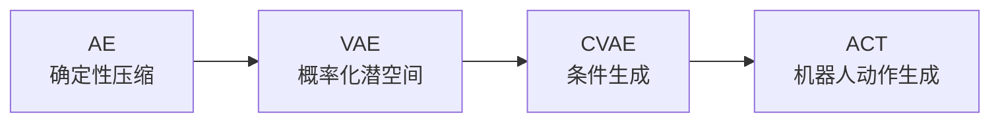
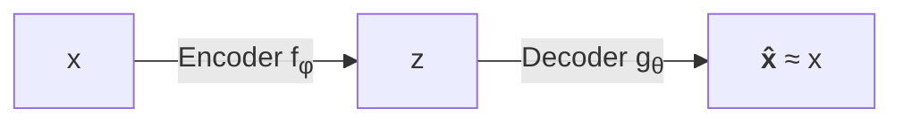
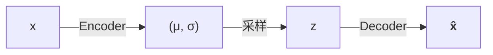
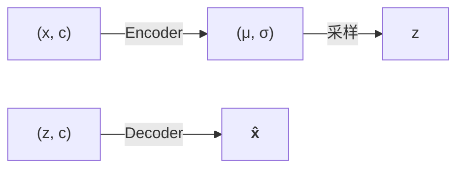
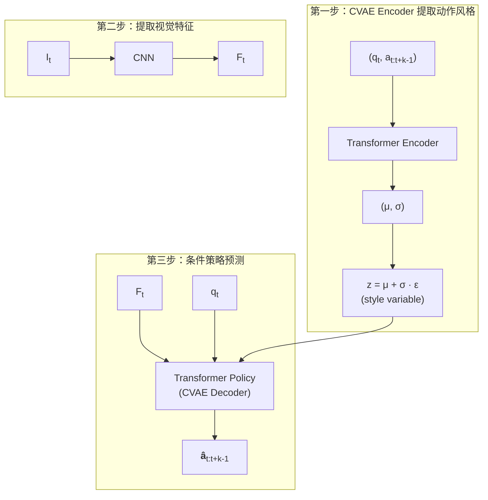

# AE → VAE → CVAE → ACT：生成式建模与机器人动作学习

## 学习动机

这份笔记梳理从自编码器到 ACT（Action Chunking with Transformers）的完整技术演进路线。这四个模型不是孤立的，而是一条逐步解决问题的链条：



每条技术路线回答一个核心问题：

| 模型 | 核心问题 |
|------|---------|
| AE | 如何把高维数据压缩成低维表示并恢复？ |
| VAE | 如何让潜在空间连续、规则、可采样生成新数据？ |
| CVAE | 如何在给定条件下生成多种合理结果？ |
| ACT | 如何将条件生成模型用于机器人模仿学习？ |

> [!abstract] 核心主线
> 从**确定性表示** → **概率分布表示** → **条件概率分布** → **机器人条件动作序列生成**

---

## 一、统一符号约定

在深入之前，先约定全文使用的符号：

| 符号 | 含义 |
|------|------|
| $x$ | 需要建模的数据（图像或动作序列） |
| $z$ | 潜变量 / latent code |
| $c$ | 条件信息 |
| $o_t$ | 机器人在时刻 $t$ 的观测 |
| $a_t$ | 机器人在时刻 $t$ 的动作 |
| $a_{t:t+k-1}$ | 从时刻 $t$ 开始、长度为 $k$ 的动作序列 |

> [!important] 关键映射：从 CVAE 到 ACT
> 将需要生成的数据 $x$ 换成**未来动作序列** $a_{t:t+k-1}$，
> 将条件 $c$ 换成**机器人当前观测** $o_t$。
>
> 这就是从生成模型跨越到机器人模仿学习的核心一步。

---

## 二、AE：从高维数据中提取低维表示

### 2.1 核心思想

输入高维数据 $x \in \mathbb{R}^D$（如图片，几万到几十万像素），真正决定内容的因素其实很少（物体类别、位置、颜色、姿态、光照等）。AE 的目标是把高维输入压缩成低维向量 $z \in \mathbb{R}^d$（$d \ll D$），再从 $z$ 恢复原始数据。

### 2.2 结构



- **Encoder**: $z = f_\phi(x)$ — 将输入压缩为潜变量
- **Decoder**: $\hat{x} = g_\theta(z)$ — 从潜变量重构输入

训练目标：$\mathcal{L}_{\text{AE}} = \|x - \hat{x}\|_2^2$ 或 $\|x - \hat{x}\|_1$

### 2.3 为什么 AE 能学到有效编码？

因为 $\dim(z) < \dim(x)$，编码器无法保留全部细节，只能提取对重构**最重要**的信息。例如输入数字"3"的图片，$z$ 可能隐含表示数字类别、字体粗细、倾斜程度、书写风格。

### 2.4 AE 的局限

> [!warning] AE 的三个问题
>
> 1. **潜在空间不连续**：两个样本编码之间可能存在模型从未见过的空洞区域，从中间随机采样 $z$ 可能无法生成有意义结果。
> 2. **潜在空间没有统一分布**：只要求能重构，不要求编码服从已知分布 → 不知道应该从哪里采样 $z$。
> 3. **一个输入只有一个编码**：无法表达不确定性，同一模糊输入可能对应多种合理解释。

> [!question] 自然的问题
> 能不能不让 Encoder 输出一个确定点，而是输出一个**概率分布**？→ 引出 VAE

---

## 三、VAE：从"编码点"到"编码分布"

### 3.1 核心变化

AE 输出确定向量 $z = f_\phi(x)$，VAE 不直接输出 $z$，而是输出概率分布的参数：

$$q_\phi(z|x) = \mathcal{N}\big(\mu(x), \operatorname{diag}(\sigma^2(x))\big)$$

一个输入 $x$ 不再对应潜在空间中的一个点，而是对应一个**区域**。然后从该分布采样 $z \sim q_\phi(z|x)$，再送入 Decoder。



> [!summary] AE vs VAE
> - AE Encoder 输出一个**确定向量**
> - VAE Encoder 输出一个**概率分布**

---

## 四、重参数化技巧（Reparameterization Trick）

### 4.1 为什么需要？

直接从 $\mathcal{N}(\mu, \sigma^2)$ 采样 $z$ 会使反向传播中断（采样不是确定性可微运算）。

### 4.2 解决方案

先从标准正态分布采样噪声：$\epsilon \sim \mathcal{N}(0, I)$，再计算：

$$\boxed{z = \mu + \sigma \odot \epsilon}$$

此时 $z \sim \mathcal{N}(\mu, \sigma^2)$ 成立，因为：
- $E[z] = E[\mu + \sigma\epsilon] = \mu$
- $\operatorname{Var}(z) = \sigma^2 \operatorname{Var}(\epsilon) = \sigma^2$

> [!tip] 关键理解
> VAE 并不是直接将标准正态样本当作最终编码。从标准正态采样的是**噪声 $\epsilon$**，最终潜变量是 $z = \mu + \sigma\epsilon$。

重参数化后，梯度可以通过 $z$ 继续传播到 $\mu$ 和 $\sigma$：
- $\frac{\partial z}{\partial \mu} = 1$
- $\frac{\partial z}{\partial \sigma} = \epsilon$

---

## 五、VAE 的损失函数与 KL 约束

### 5.1 损失函数

$$\mathcal{L}_{\text{VAE}} = \mathcal{L}_{\text{recon}} + \beta \cdot \mathcal{L}_{\text{KL}}$$

**重构损失** $\mathcal{L}_{\text{recon}} = \|x - \hat{x}\|$：要求潜变量保留足够信息以恢复输入。

**KL 散度** $D_{\mathrm{KL}}\left(q_\phi(z|x) \parallel \mathcal{N}(0,I)\right)$：约束后验分布不要偏离先验太远。

对于对角高斯分布，KL 散度有解析解：

$$D_{\mathrm{KL}} = \frac{1}{2} \sum_{j=1}^{d} \left(\mu_j^2 + \sigma_j^2 - \log\sigma_j^2 - 1\right)$$

### 5.2 为什么选标准正态作为先验？

1. **容易采样**：训练完成后直接 $z \sim \mathcal{N}(0,I)$，送入 Decoder 即可生成
2. **潜空间连续**：不同样本的编码被约束在同一个规则区域内，减少空洞
3. **数学方便**：高斯后验与标准高斯先验的 KL 散度有解析解
4. **方便插值**：$z_\alpha = (1-\alpha)z_1 + \alpha z_2$ 可实现平滑过渡

### 5.3 所有分布都接近标准正态，不会重复吗？

不会。因为存在两股相反的力量：

| 力量 | 方向 | 效果 |
|------|------|------|
| KL 损失 | $\mu \to 0,\ \sigma \to 1$ | 拉向先验 |
| 重构损失 | 不同输入保持差异 | 拉向各自区域 |

> [!success] 最终平衡
> 分布彼此**有区别但不能过度分散**。如果所有输入都被编码为完全相同的 $\mathcal{N}(0,I)$，则 $z$ 不再包含输入信息，Decoder 无法重构不同样本 → 重构损失会显著增大。

### 5.4 后验坍塌（Posterior Collapse）

> [!danger] 后验坍塌
> 如果 KL 约束过强：$q_\phi(z|x) \approx \mathcal{N}(0,I)$ 对所有输入成立。
> 此时 $\mu(x) \approx 0$，$\sigma(x) \approx 1$，潜变量不再携带输入信息，Decoder 忽略 $z$。
>
> 实际训练中需要平衡 $\mathcal{L}_{\text{recon}}$ 和 $\beta\mathcal{L}_{\text{KL}}$。

---

## 六、CVAE：条件变分自编码器

### 6.1 为什么需要 CVAE？

VAE 能生成数据但不能控制生成内容。我们希望：
- 给定"数字 3"这个条件 → 生成不同风格的数字 3
- 给定机器人当前观测 → 生成适合当前环境的动作

### 6.2 核心变化

| | VAE | CVAE |
|------|------|------|
| 学习目标 | $p(x)$ | $\boxed{p(x \mid c)}$ |
| Encoder | $q_\phi(z \mid x)$ | $q_\phi(z \mid x, c)$ |
| Decoder | $p_\theta(x \mid z)$ | $p_\theta(x \mid z, c)$ |

整体流程：



### 6.3 $c$ 和 $z$ 的分工

以手写数字为例：

- **$c$（条件）决定"生成什么"**：数字类别（3）
- **$z$（潜变量）决定"以什么方式生成"**：书写风格（瘦长/倾斜/圆润）

> [!tip] 为什么 Encoder 也需要条件？
> 条件 $c$ 已经提供了一部分信息。如果 Encoder 不知道 $c$，$z$ 必须同时编码类别+风格+细节。Encoder 知道 $c$ 后，$z$ 只需表示条件确定后**仍然存在的变化**（如 $c$ 已说明是数字 3，$z$ 就不需要再编码"类别是 3"）。

### 6.4 CVAE 损失函数

$$\mathcal{L}_{\text{CVAE}} = \mathcal{L}_{\text{recon}} + \beta \cdot D_{\mathrm{KL}}\left(q_\phi(z|x,c) \parallel \mathcal{N}(0,I)\right)$$

很多实现中简单先验 $p(z|c) = p(z) = \mathcal{N}(0,I)$。

---

## 七、从 CVAE 到机器人模仿学习

### 7.1 行为克隆的基本问题

收集示教数据 $\mathcal{D} = \{(o_t, a_t)\}$，学习策略 $\pi_\theta(a_t | o_t)$。

### 7.2 单步确定性预测的三个问题

> [!warning] 问题一：误差累积
> 训练数据中的状态来自专家 $o_t^{\text{expert}}$，但机器人实际执行时，预测误差使其逐渐进入训练集未出现的状态 → 误差随时间累积。

> [!warning] 问题二：示教停顿的时序相关性
> 示教者某位置停顿 20 帧，期间 $o_t \approx o_{t+1} \approx \cdots \approx o_{t+19}$，但 $o_t \to$ 继续停顿，$o_{t+19} \to$ 恢复运动。单步策略只看当前观测，无法判断"刚停下"还是"已停了很久"。

> [!warning] 问题三：动作分布的多模态性
> 同一观测下存在多种合理动作（如从左侧/右侧接近瓶子）。普通 MSE 回归可能学习不同动作的**平均值**，而平均值可能不是任何一种有效操作模式。

### 7.3 将 CVAE 映射到动作生成

令 $x = a_{t:t+k-1}$（未来动作序列），$c = o_t$（当前观测）：

$$\boxed{p(a_{t:t+k-1} \mid o_t)}$$

意思是：**给定机器人当前观测，生成接下来一段合理的动作。**

- CVAE Encoder：$q_\phi(z \mid a_{t:t+k-1}, o_t)$
- CVAE Decoder：$p_\theta(a_{t:t+k-1} \mid o_t, z)$

其中 $z$ 表示示教中的隐含变化：接近方向、动作速度、操作风格、停顿模式、不同但合理的动作方案。

---

## 八、ACT：Action Chunking with Transformers

### 8.1 ACT 是什么

$$\boxed{\text{ACT} = \text{CVAE 建模} + \text{Transformer 策略} + \text{Action Chunking} + \text{Temporal Ensemble}}$$

> [!important] 关键认知
> ACT 不是简单的"CVAE Decoder → Transformer Decoder"。更准确地说：**ACT 在 CVAE 框架中，使用 Transformer 构建动作序列编码与条件策略网络**。

### 8.2 两层"Encoder-Decoder"——最容易混淆的地方

CVAE 的 Encoder/Decoder 和 Transformer 的 Encoder/Decoder **不是同一层级的概念**：

| 层级 | Encoder | Decoder |
|------|---------|---------|
| **CVAE 层级**（概率模型层面） | $(a_{t:t+k-1}, q_t) \to z$<br/>从真实示教动作中提取风格 | $(o_t, z) \to \hat{a}_{t:t+k-1}$<br/>根据观测+风格预测动作块 |
| **Transformer 层级**（网络实现层面） | Transformer Encoder 用于实现 CVAE Encoder | Transformer Decoder 是策略网络的模块之一 |

> [!tip] 严格关系
> Transformer Decoder 只是 ACT 策略网络（CVAE Decoder）中的一个**组成部分**，策略网络还包含视觉网络（CNN）和其他模块。

---

## 九、ACT 训练流程

### 9.1 输入数据

每个训练样本包含：
- 当前关节状态 $q_t$
- 当前多视角图像 $I_t$
- 真实示教动作块 $a_{t:t+k-1}$

### 9.2 三步训练



> [!info] 风格变量（Style Variable）
> CVAE Encoder 输出的潜变量 $z$ 被称为风格变量，它捕捉示教中"怎么做"的隐含变化，与"做什么"（由观测 $o_t$ 决定）分离。

### 9.3 损失函数

$$\mathcal{L}_{\text{ACT}} = \underbrace{\|a_{t:t+k-1} - \hat{a}_{t:t+k-1}\|_1}_{\text{动作重构损失}} + \beta \cdot \underbrace{D_{\mathrm{KL}}\left(q_\phi(z|q_t, a_{t:t+k-1}) \parallel \mathcal{N}(0,I)\right)}_{\text{KL 损失}}$$

使用 L1 损失（而非 L2）对异常动作值更鲁棒。

---

## 十、Action Chunking：为什么一次预测 $k$ 步？

### 10.1 核心动机

传统单步策略 $\pi_\theta(a_t|o_t)$ → ACT 策略 $\boxed{\pi_\theta(a_{t:t+k-1}|o_t)}$，每次预测一整段动作序列。

### 10.2 四个好处

1. **降低有效决策长度**：任务总长 $T$，单步需 $T$ 次决策，动作块长度 $k$ 使有效决策次数降为约 $T/k$
2. **学习完整动作片段**：一段动作块对应有语义的操作单元（接近瓶子 → 闭合夹爪 → 抬起瓶子 → 旋转瓶盖）
3. **缓解示教停顿问题**：模型学习的是完整的"停-停-停-向前-向前"模式，而非每帧重新判断
4. **建模时序结构**：相比单帧速度预测，动作块能学习更完整的时序依赖

### 10.3 $k$ 的选择

| $k$ 过小 | $k$ 过大 |
|----------|----------|
| 有效时域仍然很长 | 策略更接近开环控制 |
| 容易出现误差累积 | 无法及时利用新观测 |
| 时序模式建模不足 | 长序列预测难度增大 |

需要在**长期动作一致性** ↔ **闭环反应能力** 之间平衡。

---

## 十一、Temporal Ensemble：时间集成

### 11.1 同一个动作被预测多次

假设 $k=4$：

| 时刻 | 预测的动作块 |
|------|------------|
| $t=1$ | $\hat{a}_{1\|1}, \hat{a}_{2\|1}, \hat{a}_{3\|1}, \hat{a}_{4\|1}$ |
| $t=2$ | $\hat{a}_{2\|2}, \hat{a}_{3\|2}, \hat{a}_{4\|2}, \hat{a}_{5\|2}$ |
| $t=3$ | $\hat{a}_{3\|3}, \hat{a}_{4\|3}, \hat{a}_{5\|3}, \hat{a}_{6\|3}$ |

针对时刻 3 的动作有**三份预测**（分别基于时刻 1、2、3 的观测）。

### 11.2 加权融合

$$a_t^{\text{exec}} = \frac{\sum_s w_{t,s} \cdot \hat{a}_{t|s}}{\sum_s w_{t,s}}$$

常见权重：$w_i = \exp(-m \cdot i)$（越近的预测权重越大）

### 11.3 为什么能平滑动作？

假设每次预测包含误差 $\hat{a}_{t|s} = a_t^* + \epsilon_{t|s}$，加权平均后：

$$a_t^{\text{exec}} = a_t^* + \frac{\sum_s w_{t,s} \cdot \epsilon_{t|s}}{\sum_s w_{t,s}}$$

不同预测的误差不完全相同 → 部分误差互相抵消 → 减少关节跳变、轨迹抖动。

> [!tip] 与普通滑动平均的区别
> 普通滑动平均融合**当前预测 + 过去已执行动作**（低通滤波）。
> Temporal Ensemble 融合**不同历史观测对同一目标时刻的多份预测**（多份同目标预测的集成）。

---

## 十二、推理阶段为什么令 $z = 0$？

### 12.1 训练 vs 推理

训练时 CVAE Encoder 需要**真实未来动作** $a_{t:t+k-1}$ 才能计算 $q_\phi(z|q_t, a_{t:t+k-1})$。但推理时未来动作正是需要预测的内容 → 无法使用 CVAE Encoder。

| 阶段 | $z$ 的来源 |
|------|-----------|
| 训练 | $q_\phi(z \mid q_t, a_{t:t+k-1})$ — 从真实动作提取 |
| 推理 | $z = 0$ — 使用先验 $\mathcal{N}(0,I)$ 的均值 |

### 12.2 为什么这样可行？

这正是 KL 约束存在的根本原因：训练时必须让 $q_\phi(z|\cdot)$ 接近 $p(z) = \mathcal{N}(0,I)$。否则训练时用的 $z$ 分布与推理时 $z=0$ 所处区域不一致 → 策略网络在推理时收到从未见过的 $z$ → 输出失控。

> [!success] 从概率角度
> 训练时使用近似后验 $q_\phi(z|\cdot)$，推理时使用先验 $p(z)$ 的代表值。KL 约束保证了二者的兼容性。

---

## 十三、分工总结：谁解决什么问题？

| 组件 | 解决的问题 |
|------|-----------|
| **CVAE** | 人类示教噪声、多模态动作、不同操作风格、动作分布不确定性 |
| **Action Chunking** | 长时域误差累积、单步预测缺乏时序结构、示教停顿等非马尔可夫现象、动作片段一致性 |
| **Temporal Ensemble** | 多次预测间的不一致、动作输出抖动、轨迹不平滑、单次建模误差 |

> [!important] 关键认知
> CVAE 不是 Action Chunking 本身，二者解决的问题完全不同。CVAE 主要负责**平滑动作**也是一个常见误解——真正直接用于平滑动作的是 Temporal Ensemble。

---

## 十四、用"拧瓶盖任务"贯穿理解

%% 一个完整的机器人操作场景，帮助理解四个模型的实际差异 %%

### 用 AE

将整段动作压缩：$a_{1:T} \to z \to \hat{a}_{1:T}$

可以学习动作表示，但**不能根据当前观测实时生成动作**，也不能处理不同操作模式。

### 用 VAE

将动作编码为分布：$a_{1:T} \to (\mu, \sigma) \to z \to \hat{a}_{1:T}$

可以从潜空间采样生成不同轨迹。但**没有使用机器人当前观测** → 生成动作不能保证与当前瓶子位置匹配。

### 用 CVAE

加入条件 $c = o_t$，学习 $p(a_{t:t+k-1}|o_t)$。

瓶子在不同位置 → 模型根据当前图像和关节状态生成对应动作。$z$ 可表示从左侧/右侧接近、快速/缓慢旋转、不同手腕姿态等风格变化。

### 用 ACT

使用 Transformer 处理视觉和动作序列，一次预测 $k$ 步，下一时刻重新观测再生成新动作块，重叠预测用 Temporal Ensemble 融合。

最终形成：**当前视觉闭环 + 动作块长期结构 + 多模态风格建模 + 时间集成平滑**。

---

## 十五、四模型对比表

| 维度 | AE | VAE | CVAE | ACT |
|------|-----|-----|------|-----|
| Encoder 输出 | 确定编码 $z$ | $\mu, \sigma$ | 条件后验的 $\mu, \sigma$ | 动作风格分布参数 |
| Decoder 输入 | $z$ | 采样的 $z$ | $z, c$ | 观测、状态与 $z$ |
| 学习目标 | 重构 $x$ | 学习 $p(x)$ | 学习 $p(x \mid c)$ | 学习 $p(a_{t:t+k-1} \mid o_t)$ |
| 能否生成 | 较弱 | 是 | 是 | 生成动作 |
| 能否条件控制 | 否 | 否 | 是 | 由观测控制 |
| 是否预测动作序列 | 否 | 不一定 | 不一定 | 是 |

---

## 十六、演进逻辑：一环扣一环

```mermaid
graph TD
    AE[AE<br/>x → z → x̂<br/>学习低维表示] -->|问题：潜空间不规则，无法采样| VAE[VAE<br/>x → (μ,σ) → z → x̂<br/>概率分布 + KL 约束]
    VAE -->|问题：生成不可控| CVAE[CVAE<br/>(x,c) → z → (z,c) → x̂<br/>加入条件]
    CVAE -->|映射到机器人领域| RobotCVAE[机器人动作 CVAE<br/>x=动作序列, c=观测<br/>学习 p(a|o)]
    RobotCVAE -->|工程化| ACT[ACT<br/>CVAE + Transformer<br/>+ Action Chunking<br/>+ Temporal Ensemble]
```

---

## 十七、常见错误理解辨析

> [!bug] 错误一：VAE 直接从标准正态分布获得最终编码
> **纠正**：训练时先采样 $\epsilon \sim \mathcal{N}(0,I)$，再 $z = \mu + \sigma\epsilon$。最终 $z$ 服从 Encoder 预测的分布，标准正态只是先验约束。

> [!bug] 错误二：所有后验都接近标准正态，所以它们完全一样
> **纠正**：KL 损失要求它们不要过度分散，重构损失要求它们保留区别。最终是**有区别但连续**，而非完全相同。

> [!bug] 错误三：CVAE 只是给 Decoder 增加条件
> **纠正**：标准 CVAE 在 Encoder 和 Decoder **两侧**都加入条件：$q_\phi(z|x,c)$ 和 $p_\theta(x|z,c)$。

> [!bug] 错误四：ACT 就是将 CVAE 的 Decoder 换成 Transformer Decoder
> **纠正**：ACT 以 CVAE 为概率建模框架。CVAE Decoder 指整个策略网络（含视觉网络 + Transformer 模块），Transformer Decoder 只是策略网络内部的模块。

> [!bug] 错误五：ACT 中的 CVAE 主要负责平滑动作
> **纠正**：CVAE 主要建模示教噪声、动作多模态和操作风格。平滑动作由** Temporal Ensemble** 负责，Action Chunking 负责缩短有效时域和建模连续动作片段。

---

## 十八、个人理解与总结

### 核心洞见

整个技术路线的本质是**逐步将不确定性引入模型**：

1. AE 假设一个输入对应一个确定的潜在表示（零不确定性）
2. VAE 承认一个输入可能对应一个分布（编码不确定性）
3. CVAE 进一步承认给定条件后仍然存在多种合理输出（条件不确定性）
4. ACT 将这种条件不确定性建模用于解决真实机器人问题（动作多模态）

### 最终公式总结

$$\boxed{x \to z} \quad \text{（AE：确定编码）}$$

$$\boxed{x \to q(z|x)} \quad \text{（VAE：概率编码）}$$

$$\boxed{(x,c) \to q(z|x,c)} \quad \text{（CVAE：条件概率编码）}$$

$$\boxed{(o_t, a_{t:t+k-1}) \to q(z|\cdot) \to p(a_{t:t+k-1}|o_t, z)} \quad \text{（ACT：机器人动作生成）}$$

### 一句话概括

> AE 通过编码器和解码器学习数据的低维表示；VAE 将确定编码改为概率分布，并使用重参数化和 KL 约束构造连续、可采样的潜在空间；CVAE 进一步加入条件，使模型能够在给定条件下生成多种合理输出；ACT 则将 CVAE 应用到机器人模仿学习中，把当前视觉和机器人状态作为条件，把未来动作块作为生成目标，并结合 Transformer、Action Chunking 和 Temporal Ensemble，实现具有时序一致性、闭环反馈能力和较平滑轨迹的机器人动作预测。

---

## 相关笔记

- [[具身智能]] — MOC 入口
- [[论文/论文|论文阅读]] — ACT 原论文及相关工作
- [[实验/实验|实验记录]] — ACT 实操实验
- [[基础/基础|基础理论]] — 更多基础理论笔记
