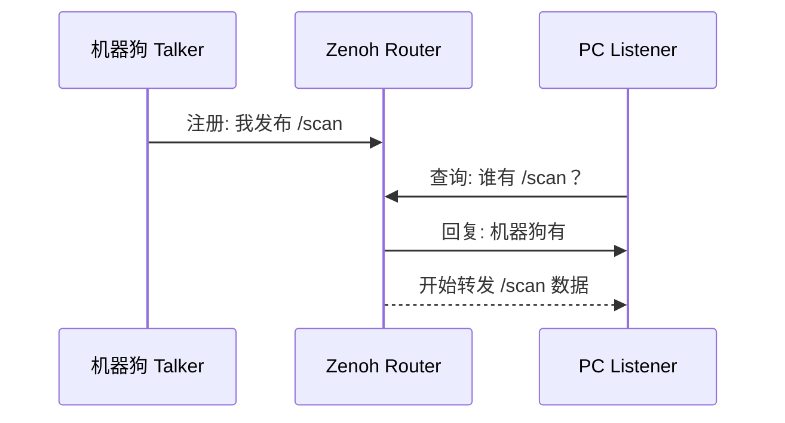

# ROS2 Zenoh 通信架构详解

> 从通信栈底层出发，理解 ROS2 如何从 DDS 演进到 Zenoh Router 架构。

## 一、核心认知：ROS2 本身不负责通信

很多人以为 ROS2 就是通信框架，其实不是。

真正负责网络通信的是 **RMW**（ROS Middleware）。

```
用户代码 (talker / listener)
        ↓
    rclcpp (ROS2 C++ API)
        ↓
     RMW (ROS Middleware)
        ↓
  真正网络协议 (DDS / Zenoh)
```

当你执行 `ros2 run demo_nodes_cpp talker`，talker 并没有自己发 TCP 包，而是交给 RMW 层处理。

> [!important] RMW 是 ROS2 通信栈最关键的一层。切换 RMW 实现 = 切换整个通信协议。

| RMW 实现 | 底层协议 |
| -------- | -------- |
| `rmw_fastrtps_cpp` | FastDDS |
| `rmw_cyclonedds_cpp` | CycloneDDS |
| `rmw_zenoh_cpp` | Zenoh |

## 二、传统 DDS 是怎么工作的

DDS（Data Distribution Service）是**完全去中心化**的设计：

> 没有服务器，所有节点互相广播发现。

### 通信过程

1. 机器狗发布 `/scan`，会 multicast 广播："有人发布 /scan"
2. PC 订阅 `/scan`，也会广播："谁有 /scan？"
3. 双方通过广播互相发现
4. 建立 peer-to-peer 直连
5. 开始传输数据


### DDS 在真实机器人场景的问题

| 场景 | DDS 表现 |
| ---- | -------- |
| 多机器人 | 广播风暴，网络拥塞 |
| WiFi 弱网 | 丢包严重，发现失败 |
| 跨网段 | 无法发现 |
| NAT | 完全失效 |
| Docker | 网卡混乱，multicast 选错接口 |
| VPN | multicast 被禁 |

> [!warning] DDS 的设计前提是"可靠局域网 + 少量节点"。机器人多机协同、弱网、云边协同场景下会系统性失效。

## 三、Zenoh 的设计哲学

Zenoh 的核心思想：

> 不要让所有节点互相广播，而是统一连接到一个 Router。

### 类比

| 系统 | 中心节点 |
| ---- | -------- |
| ROS1 | ROS Master |
| MQTT | Broker |
| WebSocket | Server |
| **Zenoh** | **Router** |

### 架构对比

```
传统 DDS:                     Zenoh:
节点 ←→ 节点                   节点 → Router ← 节点
节点 ←→ 节点                   节点 →   |   ← 节点
节点 ←→ 节点                   节点 →   |   ← 节点
(去中心化)                     (中心化路由)
```

## 四、Router 到底是什么

可以把 Router 理解成 **ROS2 世界里的交换机 + 调度中心**。

### Router 的职责

| 功能 | 说明 |
| ---- | ---- |
| 节点发现 | 谁发布了什么 topic |
| Topic 注册 | 维护 topic 表 |
| 数据路由 | 把数据从 publisher 转发给 subscriber |
| Session 管理 | 谁连进来了，状态如何 |
| QoS 协调 | 通信策略（可靠/尽力、优先级等） |
| 网络桥接 | 跨网段、跨协议转发 |

### Router 内部维护一张 Topic Table

| Topic | Publisher |
| ----- | --------- |
| /scan | robot |
| /tf | robot |
| /odom | robot |
| /chatter | robot_talker |

> [!note] 节点不再互相发现，而是向 Router 注册和查询。Router 是唯一知道"谁有什么"的实体。

## 五、rmw_zenohd 是什么

你在机器狗上运行的 `rmw_zenohd` 就是 **Zenoh Router**。

```bash
ros2 run rmw_zenoh_cpp rmw_zenohd
```

它监听 `tcp/7447`，等待其他节点连接。

```bash
ss -tunlp | grep 7447
# 正确输出：*:7447   (即 0.0.0.0:7447，对外监听)
# 错误输出：127.0.0.1:7447  (仅本地回环，外部无法连接)
```

> [!warning] 如果看到 `127.0.0.1:7447`，说明 Router 只监听本地回环，外部 PC 永远连不上。

## 六、完整通信流程（逐步拆解）

假设机器狗发布 `/scan`，PC 订阅 `/scan`：

### Step 1: 机器狗发布

```
talker 发布 /scan
  → rclcpp
    → rmw_zenoh_cpp
      → 连接本地 Router
        → 告诉 Router："我发布 /scan"
          → Router 记录到 Topic Table
```

### Step 2: PC 订阅

```
listener 订阅 /scan
  → rclcpp
    → rmw_zenoh_cpp
      → 连接机器狗 Router
        → 向 Router 查询："谁有 /scan？"
```

### Step 3: Router 路由

```
Router 查表
  → 回复 PC："机器狗 talker"
    → 建立转发通道
      → 数据开始流动
```



## 七、为什么 PC 不需要自己的 Router

一个网络里只需要一个"中心"。机器狗上已经有 `rmw_zenohd`。

```
机器狗 = Router Server  (监听 tcp/7447，等待连接)
PC     = Router Client  (主动连接机器狗 Router)
```

### 什么时候 PC 也需要 Router？

只有在多机器人大型系统中：

```
          中央 Router (工业 PC)
         /    |    \
        /     |     \
     狗1     狗2    工作站
```

单机器狗 + 单 PC，一个 Router 就够。

## 八、配置文件到底做了什么

PC 端配置文件 `~/.zenoh/zenoh.json5`：

```json5
{
  mode: "client",

  connect: {
    endpoints: [
      "tcp/192.168.168.100:7447"
    ]
  }
}
```

本质含义：

> "不要自动发现 Router，直接连接 `192.168.168.100:7447` 这个机器狗 Router。"

### 加载方式

```bash
export ZENOH_SESSION_CONFIG_URI=$HOME/.zenoh/zenoh.json5
export RMW_IMPLEMENTATION=rmw_zenoh_cpp
```

## 九、为什么之前会失败

没有配置 `connect/endpoints` 时，Zenoh 不知道 Router 在哪里。

### Zenoh 默认行为

```
尝试自动发现 Router
  → WiFi / Docker / NAT 环境下自动发现失败
    → 退而尝试 localhost (127.0.0.1)
      → "我本机是不是有 Router？"
        → 没有
          → Unable to connect to a Zenoh router
```

> [!bug] 日志中看到 `tcp/127.0.0.1:xxxxx` 说明 PC 根本没有连到机器狗，而是在本机白找。

## 十、最终系统拓扑

```
               ┌─────────────────┐
               │   Zenoh Router  │
               │   rmw_zenohd    │
               │  tcp://:7447    │
               │    (机器狗)      │
               └────────┬────────┘
                        │
         ┌──────────────┼──────────────┐
         │                              │
┌────────▼────────┐          ┌─────────▼────────┐
│  机器狗 ROS2 节点 │          │    PC ROS2 节点   │
│  talker / lidar │          │  listener / rviz2 │
│  /scan /tf /odom│          │                   │
└─────────────────┘          └───────────────────┘
```

## 十一、为什么机器人行业越来越喜欢 Zenoh

| 场景 | Zenoh 表现 | 原因 |
| ---- | ---------- | ---- |
| 多机器人 | 极强 | Router 统一路由，无广播风暴 |
| 云机器人 | 极强 | 原生支持 WAN/跨网段 |
| NAT 穿透 | 强 | TCP 连接由内向外发起 |
| VPN | 强 | 不依赖 multicast |
| Docker | 强 | 不绑定网卡，TCP 直连 |
| 跨网段 | 强 | Router 做桥接 |
| WiFi 弱网 | 强 | 有 QoS 和重传机制 |
| 边缘计算 | 强 | 支持层级 Router Mesh |

## 十二、日常工作流程

### 机器狗端 （不需要手动配置，开机自启动）

```bash
source /opt/ros/humble/setup.bash
export RMW_IMPLEMENTATION=rmw_zenoh_cpp

# 启动 Router（只需一次）
ros2 run rmw_zenoh_cpp rmw_zenohd &

# 启动传感器驱动
ros2 launch your_robot bringup.launch.py
```

### PC 端

```bash
source /opt/ros/humble/setup.bash
export RMW_IMPLEMENTATION=rmw_zenoh_cpp
export ZENOH_SESSION_CONFIG_URI=$HOME/.zenoh/zenoh.json5

# 清理旧 daemon
pkill -9 -f ros
ros2 daemon stop

# 重新 source 后测试
source /opt/ros/humble/setup.bash
ros2 topic list
rviz2
```

## 十三、进阶：后面会遇到的更高级架构

### 多机器人 Zenoh Mesh

```
                中央 Router (边缘服务器)
               /    |    |    \
              /     |    |     \
         狗1      狗2  狗3     工作站
```

### 云边协同

```
机器狗群 → 边缘 Router → 云端 Router → 远程监控/调度
```

### ROS2 Bridge

```
ROS2 (Zenoh) ←→ Zenoh Bridge ←→ MQTT / HTTP / WebSocket ←→ Web 前端
```

> [!tip] 这些本质上都在解决同一个问题：**机器人之间如何稳定、高效、跨网络通信。** 理解 RMW → Zenoh → Router 这条链路后，多机器人、云边协同、RMF 都会非常容易上手。
