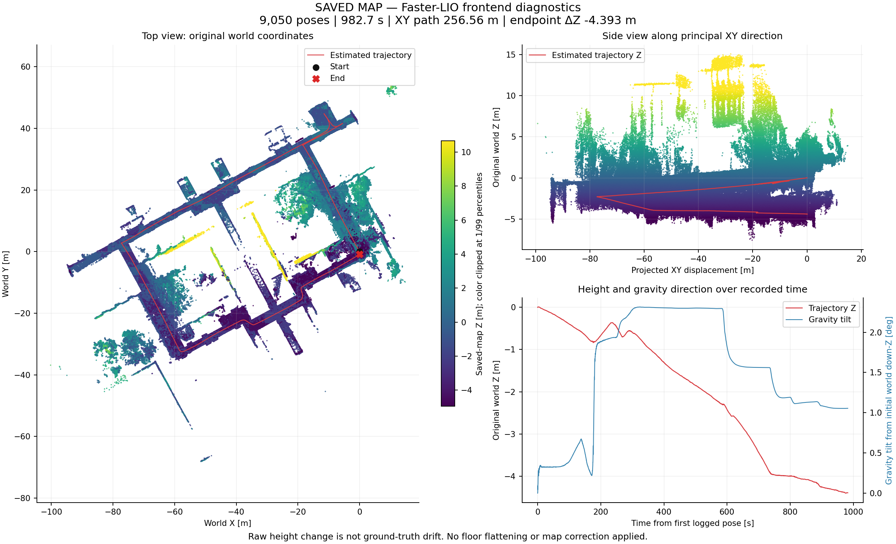

# D1 Max 中心 IMU 与回环建图对比报告

## 结论：大回环接上了，前端下沉仍然存在

2026 年 9 月 19 日，使用 9 月 17 日采集的原始 bag，完成了 **中心 IMU＋前后双雷达＋Faster-LIO＋SC-PGO** 的整包离线回放。保持 Zenoh，1 倍速运行，没有连接实机、锁定高度或事后压平地图。

后端共接纳 **4 条回环约束**，包含末段关键帧与起始关键帧的约束 **0 ↔ 640**。在同一组 644 个关键帧上，首尾高度差从 **−4.397 m** 变为 **＋0.0496 m**，说明这次回环有效校正了首尾高度错位。

但优化后轨迹仍有 **1.485 m 的高度跨度**。这不能证明所有走廊已经水平，更不能解释为“达到 5 cm 定位精度”。本次没有外部真值，也未证明物理起终点完全重合。

前端的 9,050 个状态时间、位置、姿态四元数和重力向量，与上一轮中心 IMU 前端-only 实验完全一致。**SC-PGO 改善的是后端地图，没有修好或改写前端自身的下沉。** [[项目/D1 Max 无回环建图稳定性验证]] 与 [[项目/D1 Max 坐标系与地图倾斜系统梳理]] 仍需继续，不能因本次回环成功而勾选完成。

## 一、先看原始地图与优化地图


图中左列是原始前端地图，右列是回环优化地图；两边使用共同的坐标范围和高度色带，没有为了好看对地图校平或拟合对齐。底部红线为前端关键帧高度，蓝色虚线为后端重新优化的历史关键帧高度，**不是实时前端一开始就具有蓝线所示精度**。

侧视图包含墙体、树木和建筑结构，不能把整张点云的 Z 范围当成地面平整度。原始地图来自全量前端点云，优化地图来自降采样后的关键帧，点数也不是精度分数。

| 同一组 644 个关键帧 | 前端原始 | SC-PGO 优化 |
|---|---:|---:|
| 首尾 Z 差 | −4.397 m | ＋0.0496 m |
| 首尾 XY 距离 | 0.810 m | 1.892 m |
| 首尾三维距离 | 4.471 m | 1.893 m |
| 轨迹 Z 最大值－最小值 | 4.398 m | 1.485 m |

没有隐去“XY 首尾距离增大”这一项：首尾距离不是测量真值误差，物理起终点是否重合尚未验证，不能预设它们应当完全重合；同样，也不能只挑 Z 变小来宣称整体精度已经合格。以上数字见随附的 [对比指标 JSON](../附件/2026-09-19-central-imu-lio-pgo/evidence/loop_result.json)。

## 二、本次到底使用了什么数据与配置

原始 bag：`/home/dndx/d1max_nav_ws/bags/slam_raw_20260917_171716_fe8f38`。仅回放前雷达、后雷达和 `/imu_driver/imu_central`，不回放厂家 TF，也不使用前雷达 IMU 驱动本次 LIO。

| 配置项 | 本次实际设置 | 解释与边界 |
|---|---|---|
| 通信与运行 | `rmw_zenoh_cpp`、Domain 219、1 倍速 | 没有切换 DDS；原始 bag 与生产 YAML 不变 |
| 中心 IMU 适配 | 加速度 ×9.80665、角速度 ×1、时间戳 −13 ms | 加速度单位来自数据检查；时间偏移是相对相位估计，可能包含滤波延迟，不是已证明的纯时钟差 |
| 中心 IMU 轴向 | 保留原始向量轴向 | 雷达到中心 IMU 的旋转由 Faster-LIO 外参承担，不重复转轴 |
| 实验外参 | 固定旋转、名义安装平移，在线外参估计关闭 | 旋转来自同 bag 陀螺拟合，平移依赖中心原点假设，**不是完整出厂标定** |
| 前端／后端 frame | `camera_init`／`map`，body 为 `central_imu` | 后端使用本次前端的成对里程计和 body 点云，不再次施加 IMU 时间偏移 |
| 关键帧门限 | 累计位移约 0.5 m 或姿态变化约 4° | 只挑代表性扫描参与后端，不是每帧都建立图节点 |
| 回环候选检查 | 15 Hz | 相较旧实时配置的 1 Hz，减少只检查最新关键帧时的遗漏；不是每秒接受 15 次回环 |
| 全局地图显示 | 0.2 Hz，即约 5 秒一次 | 与之前实时后端相同，不是前端处理频率 |
| 地图／关键帧下采样 | 0.08 m／0.20 m | 几何接纳门限未修改，没有通过放宽检查强行闭环 |

本次 SC-PGO 二进制与 9 月 17 日的 `sc_pgo_final` 相同，但不等于当天 19:01 最初实时运行的旧版本。因此不能把跨日两次运行简单当成“只换一个 IMU”的严格消融试验。版本摘要与生效参数见 [附件证据索引](../附件/2026-09-19-central-imu-lio-pgo/README.md)。

## 三、关键帧与回环分别做什么

关键帧可以理解为从连续雷达扫描中挑出的“代表性照片”。前端持续估计运动；后端在移动或姿态变化达到门限时，保留一帧点云及其位姿，用来拼地图、检索曾经来过的位置。

本次接纳的约束为 **118↔178、117↔193、101↔209、0↔640**。只统计事件日志中明确的 `accepted`，不把候选、排队或中间几何确认当成成功回环。4 条约束也不等于经过了 4 个独立回环场所。

发现可靠的重访对应后，后端调整历史关键帧位姿，再用这些位姿重新拼地图；不是只把最后一帧抬高，也不是把整张地图整体平移。后端接纳因子属于内部几何核验，不能替代独立精度验收。[原始回环事件](../附件/2026-09-19-central-imu-lio-pgo/evidence/loop_events.csv) 随文保留。

## 四、数据完整性与前端诊断

| 项目 | 结果 |
|---|---:|
| 中心 IMU 适配器实际接收／转发 | 192,971／192,971 |
| 前／后雷达消息观测数 | 9,364／9,325 |
| 前端位姿 | 9,050 |
| 前端传感器时间跨度 | 982.700 s，约 bag 时长的 99.77% |
| PGO 关键帧／原始轨迹行／优化轨迹行 | 644／644／644 |
| 前端原始地图 | 2,149,746 点，34,396,128 字节 |
| 回环优化地图 | 1,127,596 点，18,041,728 字节 |
| 两张地图的非有限 XYZ 点数 | 均为 0 |

开头包含初始化，因此位姿时间跨度不等于 bag 完整时长。全量 9,050 帧的首尾 Z 差为 **−4.392741 m**；前表的 **−4.397143 m** 来自选出的 644 个关键帧，取样终点不同，不能混用。

旁路 best-effort 观测器的 IMU 计数不等于适配器实收，更不是算法消费证明；实收／转发数量取自适配器自身审计。它保留了 18,410 对连续重复六轴样本及原始数据间隔，没有通过插值伪造高频数据。



图及 [前端指标 JSON](../附件/2026-09-19-central-imu-lio-pgo/evidence/frontend_result.json) 保留了原始下沉现象。类地面平面抽样依赖估计轨迹与可见点云，不是测量真值；尚不足以把漂移归因于某一颗 IMU 或某一个外参参数。

## 五、为什么黄色实时点云看起来没有人影

本次 RViz 同时显示两层：按高度着色的全局背景为 `/d1max/pgo/map`；黄色为 `/d1max/faster_lio/cloud_registered` 当前扫描，`Decay Time=0`，新帧替换旧帧。前端原始全量地图层默认关闭，避免两张全局图叠在一起。

黄色只是显示颜色，**并不识别人或删除人影**。前端原始地图像叠加很多张照片，会保留行人经过的不同位置；现有累积器不会因为后来那里变空就删除旧体素。PGO 只取关键帧并降采样，残影可能更少、更淡，但没有专门的动态物体剔除功能。回环主要改善静态结构的错位，不保证清除移动物体。

## 六、产物、收尾与复现边界

原始运行目录为：

```text
/home/dndx/d1max_nav_ws/maps/runs/20260919_125722_855277_central_imu_faster_lio_sc_pgo_zenoh/
  d1max_map_20260919_131415.pcd    前端原始地图
  scans.pcd                      上述文件的符号链接，不是第三张地图
  sc_pgo/optimized_map.pcd        回环优化地图
  sc_pgo/loop_events.csv          接纳／拒绝事件
  sc_pgo/*poses.txt、times.txt    关键帧位姿与传感器时间
  frontend_state.csv             全量前端状态
  central_imu_adapter.json        IMU 实收／转发审计
  config/、manifest.json          生效配置与来源摘要
  result.json、REPORT.md          本次原始结果与报告
```

本次只落盘两张物理 PCD，没有保存成批关键帧 Scans PCD 或 body_samples。知识库随附图表、小体积证据及参数，不复制完整 bag、PCD 或全量前端 CSV；在其他电脑可以读报告和核对关键帧指标，但重跑整个算法仍需要本机原始数据与软件。

结束后先等待前端 10 秒，再等待后端可观察输出稳定约 15 秒；关键帧数量、两份轨迹行数、**Path 中的关键帧数量**及接受计数一致，无未决候选。这是有界启发式检查，不是后端内部队列清空证明。

**以原实验收尾时为准**，回放、前端、PGO、IMU 适配器和本轮 router 均已退出，保留了用户查看结果的 RViz 窗口。适配器在全部数据处理、地图保存和自身审计写出后，遇到 Humble 重复 shutdown 竞态，返回码为 1；[原始结果](../附件/2026-09-19-central-imu-lio-pgo/evidence/result.json) 和日志没有改写为成功。

后续仅修补实验适配器的退出清理：限定已确认的重复关闭异常，其他异常继续抛出。12 项离线回归测试通过，尚未进行新的真实 SIGINT 退出验证，未重新建图，未改变本次地图。

## 后续关联

- [[项目/D1 Max 无回环建图稳定性验证]]：前端下沉仍未验收，不因为回环接上而关闭待办。
- [[项目/D1 Max 坐标系与地图倾斜系统梳理]]：继续核对空间外参、时间偏移、重力和坐标约定。
- [[日历/2026-09-17]]：此前前雷达 IMU 与回环修复的背景；与本次条件不同，不混用指标。
- [[项目/机器狗多楼层建图导航方案]]：正式导航之前仍需地图与定位验收；本次不改变导航默认配置。

证据、哈希与阅读说明见 [附件索引](../附件/2026-09-19-central-imu-lio-pgo/README.md)。
