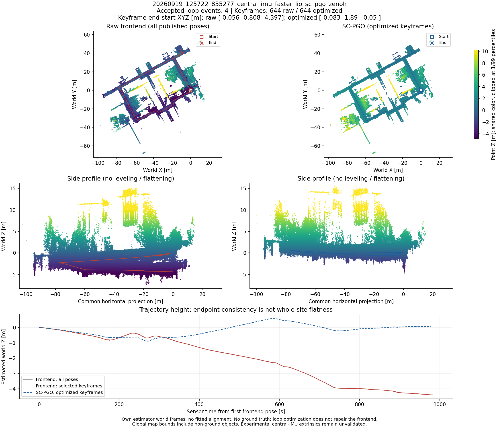
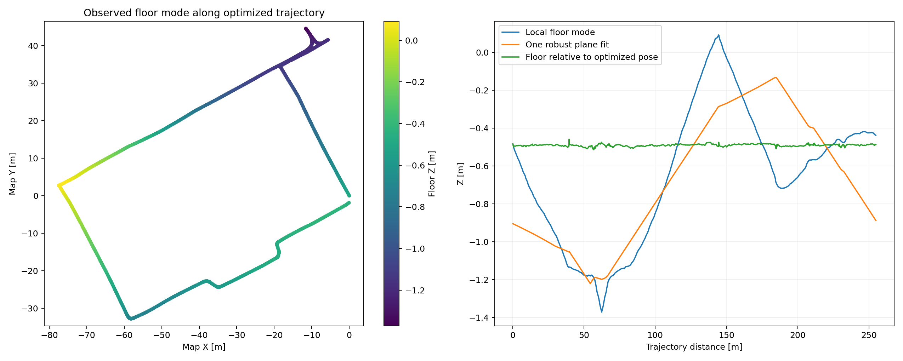
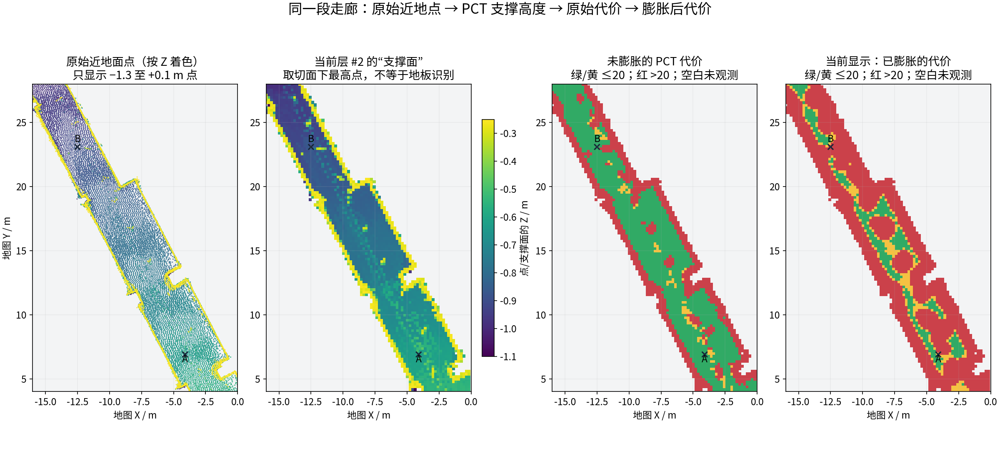
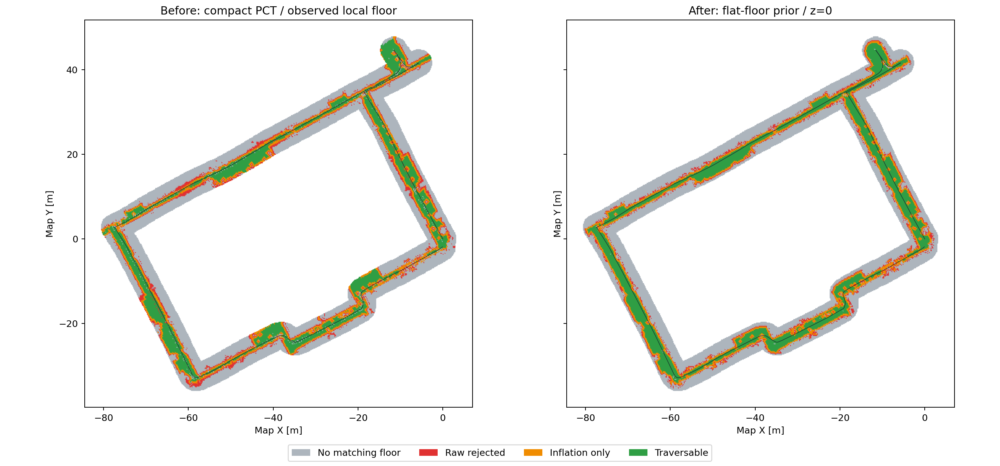
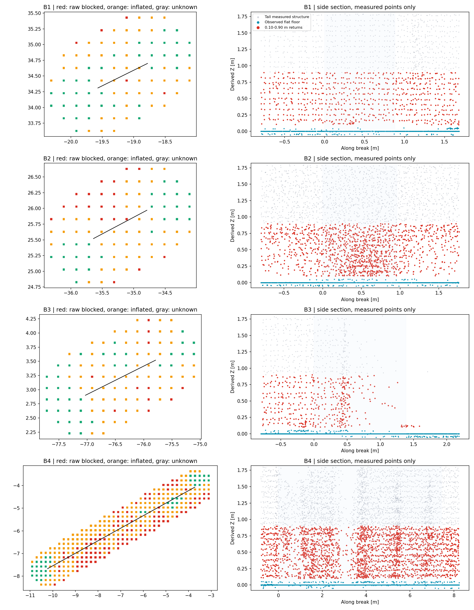
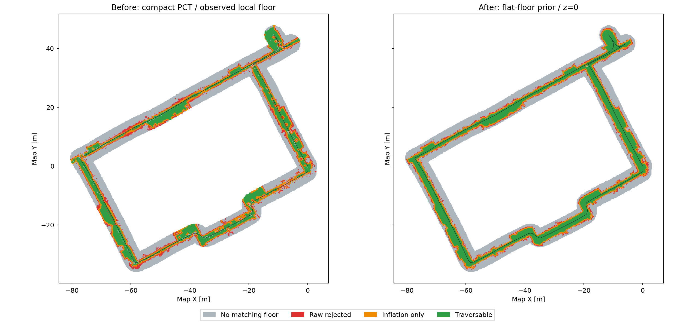
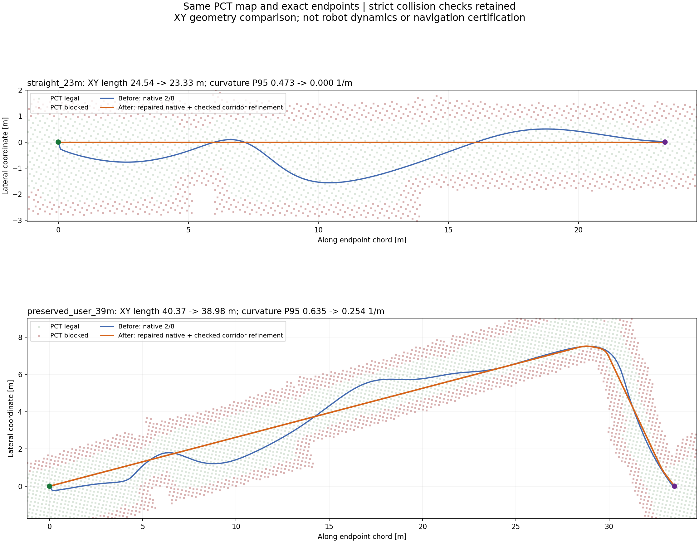

# D1 Max：从原始 PCD 到 PCT 全局规划的完整处理流程

## 1. 目标与整体流程

本次使用中心 IMU、双雷达 Faster-LIO＋SC-PGO 生成的实验室点云地图，目标是：**保留建筑主体，恢复真实走廊的连通性，并生成直路不绕、转角平滑的全局路径。**

这里的初始 PCD 已经经过回环优化，但还没有进行本轮点云后处理。实验室实际是同一水平楼层，这是后续地面校正的前提。

*右侧回环优化地图是本次输入。首尾接上不意味着整层地面已经平整，地图仍可能保留高度形变。*

整个流程为：

**原始 PCD → 结构保留型清理 → 地面提取与高度校正 → 近地异常清理 → PCT 可通行地图 → 全局搜索与路径平滑 → 完整路径检查。**

这些阶段解决的是三个不同问题：先让点云更可信，再让真实可走区域正确连通，最后让生成的路径走得合理。

## 2. 先清理异常点，保留建筑主体

原始地图中既有孤立点、稀疏杂点和人员残影，也有本来就比较稀疏的门框、墙边和细柱。直接使用强滤波，很容易在清理噪声的同时破坏建筑结构。

因此，首先用邻域密度和统计距离找出异常候选，再判断它是否属于连续的面或线。贴合墙面、门框等结构的点受到保护；没有结构依据的孤立候选才删除。判定始终基于原始点集，避免逐步删点造成连锁侵蚀。

这一阶段从约 **112.8 万点保留到 107.7 万点**，删除约 4.49%。保留点的位置不变，不做压平或补洞。

这属于几何清理，不是识别“人”的语义算法。已经积累成密集团块的人物残影，可能仍然保留，需要结合后续地面与结构信息继续判断。

## 3. 提取真实地面，修正单层地图的高度形变

清理之后，PCT 仍把一些正常走廊判断为不可通行。检查发现，问题不只是点云杂乱：**同一水平楼层在地图中出现了局部高低起伏。**

沿建图轨迹检查附近实测地面，其绝对高度跨度约 **1.46 m**。用一个平面拟合后，残差仍有约 **0.24 m**，说明并非将整张地图旋转一次就能摆正。

*实测地面与轨迹共同起伏，单一平面无法解释全部形变。这能说明地图存在高度问题，但不能据此确定是哪个 IMU、外参或前端模块导致的。*

处理方法是以历史轨迹为线索，在附近点云中寻找真实、连续的地面，建立局部地面高度场。历史轨迹只帮助寻找地面，不直接把“曾经走过的地方”涂成自由区域。

对每个位置，根据当地地面高度修正整根竖直点云柱：

**保持 X、Y 不变，将该处地面移到参考高度，上方墙体和物体随之一起移动。**

也就是 `z' = z − h(x,y)`。这与“把所有点的 Z 都设为零”完全不同，墙体高度和上下结构仍然保留。只在有可靠地面证据的范围内处理，不向大块未知区域补地面。

得到的是一份独立的平地规划副本。它是随位置变化的非刚性校正，不能通过一个固定 TF 与原始定位地图精确对应；原始 3D 地图仍保留。这一步没有解决 LIO 漂移根因，也不能照搬到室外坡地、楼梯或多层重叠地形。

## 4. 清除近地误判，让长走廊真正连通

### 为什么几个碎点会阻断整条走廊

PCT 并不直接理解哪个点属于“地板”。在一个高度切片附近，下方点形成支撑面，上方点形成上界。

因此，地板上方的一撮残影可能被当成假台阶，也可能被当成很低的顶棚。错误代价再向周围扩散，就会把几个杂点放大成一片不可通行区域。

*早期诊断依次展示近地点云、支撑高度、原始代价和膨胀后代价。判断问题时应追查实际点云，不能只看到红色就降低安全边界。*

### 从小碎簇清理，改为有结构依据的清理

第一轮去掉小碎簇后，可通行区域明显增多，但长走廊仍有断带。

*左为清理前基线，右为中间结果。绿色增多，但仍不能说明整条走廊已经连通。*

继续检查断带的侧剖面，发现更高一些的悬浮返回和近地碎点仍在制造假障碍。

*各行左侧是代价，右侧是对应点云。实际地板仍然存在，阻断往往来自其上方的零碎返回。*

最终对离地约 4～70 cm 的异常候选，结合结构证据进行判断：连续墙面、竖直细柱和具有可信顶面的低矮物体保留；缺少这些结构特征、下方又有真实地面支撑的零碎点才清除，而不是删除这一高度带中的所有点。

最后一处断带还暴露了地面支撑判断的问题：地面点被网格边界分到了相邻格子，单格计数过少，算法就误以为没有地面。改为检查实际距离范围内的地面分布后，消除了这类因网格切分造成的漏判。

*左为基线，右为最终结果。主走廊中的错误阻断减少，墙边仍保留禁止区域；目标是恢复真实通路，不是把整张地图变绿。*

整个过程没有合成人工地面点，也没有直接填充自由区域。最终规划副本保留约 **67.9 万点**；减少的点还包括缺少可靠地面校正依据、因而排除在规划范围外的部分，不能全部称为噪声。

## 5. 用处理后的 PCD 建立 PCT 可通行地图

处理后的 PCD 仍是几何点集；PCT 将它转换为能供规划使用的分层表示，描述各位置的支撑高度、上方净空、坡度、阶差和通行代价。

本次采用 20 cm 的水平网格，按实际楼面检查连续性。相邻格不仅要各自合法，高度变化也必须满足约束，不能仅靠对角接触就认为走廊连通。

在沿历史轨迹选取的同一批 **4,868 个位置**上，通过通行判断的位置从 **3,115 个增加到 4,709 个**。最终主连通区域包含 11,725 个合法格，实验室主走廊连成了同一片区域。

当前实现按 PCT 的代价逻辑构建分层地图，规划使用其原生 A* 和 GPMP；并非直接运行一套完全未修改的官方管线。未知楼面不会当作自由空间；没有观测到上界的位置虽可按当前策略继续判断，也不能视为净空已经得到实测确认。

到这一步，解决的是“哪里可以走”，还没有解决“路径是否绕路”。

## 6. 从能规划，进一步做到直路不绕、转角平滑

### 长直走廊为什么还会左右摆动

地图连通后，旧路径在部分直走廊中仍横向摆动约 2 m。对同一起终点检查发现，直线本来就能合法通过，所以这部分弯绕并非绕障所必需。

排查发现两个原因：

- **代价插值不连续。** 原实现混用了格心与半格坐标，使连续移动时的代价值出现跳变，影响优化器判断。修复后，插值坐标、权重和梯度保持一致。
- **低代价不等于少绕路。** 优化器倾向追逐走廊中零碎的低代价格子，即使存在合法直通段，也可能左右绕行。仅修复插值还不足以解决这种偏好。

### 路径生成与整理

目前先由 **A* 找到通路，GPMP 生成平滑曲线**，再通过独立模块整理路径形状：

1. 原生结果先通过完整通行检查，不合法就失败。
2. 两点之间整段可通行时，用直通段替代不必要的绕行。
3. 真实转角用五次 Bézier 曲线过渡，保持平面内切向与曲率连续。
4. 对整理后的完整曲线和最终发布路径重新检查，不能为了平滑切入墙体或禁止区域。

这一轮没有修改地图或放宽硬障碍阈值，起终点保持不变。找不到更好的合法整理结果时，保留已经通过检查的原生路径。

这里优先改善的是几何形状，不保证所有路径都在走廊正中心，软代价也可能上升。当前整理仅用于同层路径，Z 仍跟随地面；平面曲线平滑不等于机器人已经能按任意速度执行。

*蓝色为优化前，橙色为优化后。上图直走廊的多余摆动被消除，下图保留真实转角。使用相同地图与起终点，展示的是插值修复、参数调整和路径整理共同带来的效果。*

## 7. 最终效果与本次结论

| 代表用例 | 优化前路径长度 | 优化后路径长度 | 主要变化 |
|---|---:|---:|---|
| 23 m 直走廊 | 24.54 m | 23.33 m | 左右摆动消除，成为直线 |
| 18 m 直走廊 | 19.13 m | 18.13 m | 成为直线 |
| 11 m 直走廊 | 12.54 m | 11.29 m | 成为直线 |
| 带真实拐角的长路径 | 40.37 m | 38.98 m | 曲率 P95 降低约 60%，保留必要转弯 |

*长度统一为 XY 投影长度。曲率按全程每 0.1 m 重采样估计，P95 是 95% 分位值，不是最大曲率或动力学保证。*

最终 **14 组离线用例全部通过通行检查**，其中 12 组采用整理后的路径，2 组保留合法原生结果。RViz 的路径发布、订阅及实际消息接收也已核对，但这些不等于实机导航验收。

本次打通的是从原始 PCD 到可通行地图、再到经过检查的平滑全局路径。关键经验是：**先保证地面和障碍表示可信，再验证连通性，最后优化路径形状。** 三个层次不能靠不断放宽同一个阈值来替代。

后续接入导航还需要处理原定位地图与规划副本的坐标关系、机器人足迹、实时障碍、局部控制及速度约束。本次没有修复前端建图漂移，也没有验证实机高速跟踪或动态避障。

*原始图片和验证数据保留在[实验附件](../附件/2026-09-23-pcd-to-pct-planning/README.md)，正文只记录主要技术流程。*
