# D1 Max 导航系统框架总览

> [!abstract] 架构约定
> **单一任务所有权；全局路线固定；局部连续反馈；候选验证后提交；停止与恢复有独立闭环。**

本文描述 **2026-10-08 默认主线**的代码、有效会话参数和封存运行包。系统按室内外、多楼层导航设计；当前默认执行范围是一楼，Web 为 `planning_only`，实机运动验收未完成。图中的执行链表示已接入的软件合同，不表示物理导航已通过。

## 1. 系统分层与职责

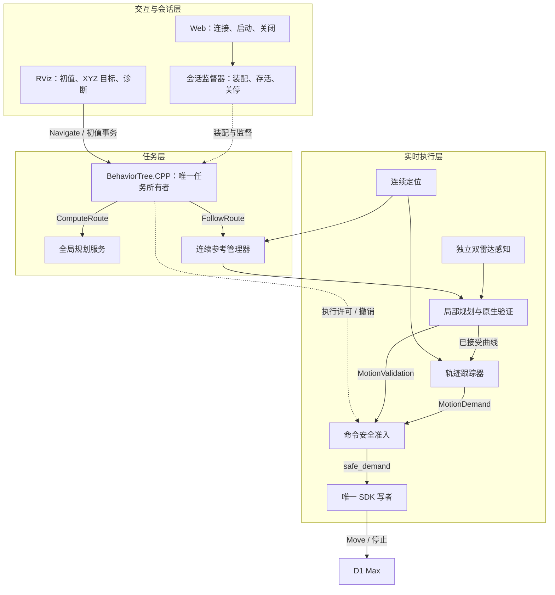
```mermaid
flowchart TB
    subgraph interaction["交互与会话层"]
        web["Web：连接、启动、关闭"]
        session["会话监督器：装配、存活、关停"]
        rviz["RViz：初值、XYZ 目标、诊断"]
        web --> session
    end
    subgraph taskLayer["任务层"]
        bt["BehaviorTree.CPP：唯一任务所有者"]
        globalWorker["全局规划服务"]
        reference["连续参考管理器"]
        bt -->|"ComputeRoute"| globalWorker
        bt -->|"FollowRoute"| reference
    end
    subgraph runtimeLayer["实时执行层"]
        localization["连续定位"]
        perception["独立双雷达感知"]
        localPlanner["局部规划与原生验证"]
        tracker["轨迹跟踪器"]
        safety["命令安全准入"]
        writer["唯一 SDK 写者"]
        perception --> localPlanner
        reference --> localPlanner
        localPlanner -->|"已接受曲线"| tracker
        tracker -->|"MotionDemand"| safety
        localPlanner -->|"MotionValidation"| safety
        safety -->|"safe_demand"| writer
        localization --> reference
        localization --> tracker
    end
    session -.->|"装配与监督"| bt
    rviz -->|"Navigate / 初值事务"| bt
    bt -.->|"执行许可 / 撤销"| safety
    robot["D1 Max"]
    writer -->|"Move / 停止"| robot
```

| 模块 | 唯一职责 | 不承担 |
|---|---|---|
| BT 导航器 | 目标、路线提交、执行意图、暂停恢复、取消、结果 | 速度计算、地图积分 |
| 全局规划服务 | 对指定地图计算一次路线 | 周期性改写已提交路线 |
| 参考管理器 | 实测进度、当前路段、局部窗口、坐标锚 | SDK 授权 |
| SCAN / GridMap | 滚动地图、候选轨迹、原生碰撞验证 | 用户任务、实际速度发送 |
| 跟踪器 | 已接受曲线的反馈跟踪与运动需求 | 接管控制权、宣布任务成功 |
| 安全准入 / SDK | 指令验证、限速、控制权、唯一发送、停止反馈 | 自行选择新目标 |

ROS 2 通信保持 **Zenoh**。当前 PCT 与 SCAN 是算法实现，不是任务层的固定接口；替换算法仍需保持路线、时间、坐标和失败语义。旧协调器、兼容入口不能成为第二个任务管理者或 SDK 写者。

## 2. 行为树与完整任务时序

### 2.1 当前树结构

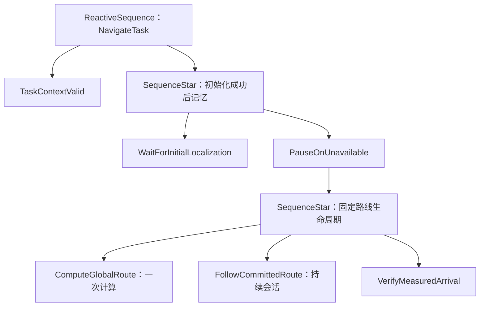
```mermaid
flowchart TB
    root["ReactiveSequence：NavigateTask"]
    identity["TaskContextValid"]
    initialized["SequenceStar：初始化成功后记忆"]
    initial["WaitForInitialLocalization"]
    pause["PauseOnUnavailable"]
    lifecycle["SequenceStar：固定路线生命周期"]
    compute["ComputeGlobalRoute：一次计算"]
    follow["FollowCommittedRoute：持续会话"]
    arrival["VerifyMeasuredArrival"]
    root --> identity
    root --> initialized
    initialized --> initial
    initialized --> pause
    pause --> lifecycle
    lifecycle --> compute
    lifecycle --> follow
    lifecycle --> arrival
```

- `SequenceStar` 保留已完成阶段，普通定位校正不会重新进入初始定位或全局计算。
- `PauseOnUnavailable` 在同身份输入缺失时暂停 tick，不 halt 当前 Action、不删除已提交路线。
- 定位 epoch/seed 改变、取消或新目标属于身份事件，走撤销与退役流程，不走普通恢复。

### 2.2 正常任务

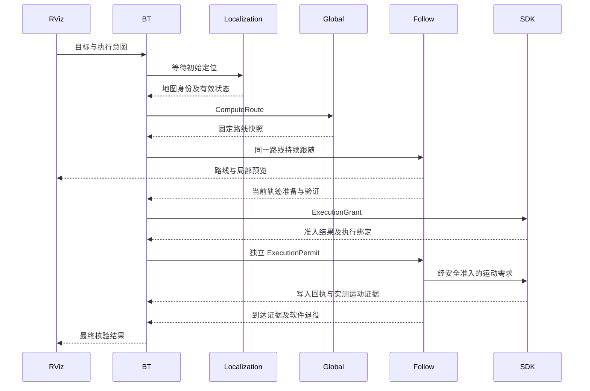
```mermaid
sequenceDiagram
    participant RViz
    participant BT
    participant Localization
    participant Global
    participant Follow
    participant SDK
    RViz->>BT: 目标与执行意图
    BT->>Localization: 等待初始定位
    Localization-->>BT: 地图身份及有效状态
    BT->>Global: ComputeRoute
    Global-->>BT: 固定路线快照
    BT->>Follow: 同一路线持续跟随
    Follow-->>RViz: 路线与局部预览
    Follow-->>BT: 当前轨迹准备与验证
    BT->>SDK: ExecutionGrant
    SDK-->>BT: 准入结果及执行绑定
    BT->>Follow: 独立 ExecutionPermit
    Follow->>SDK: 经安全准入的运动需求
    SDK-->>BT: 写入回执与实测运动证据
    Follow-->>BT: 到达证据及软件退役
    BT-->>RViz: 最终核验结果
```

执行意图有两种入口：`Navigate.request_execution=false` 为预览后确认；`true` 为目标提交时显式请求执行。两者最终进入同一个确认与 SDK 准入通道。**启动、心跳、恢复不隐式授权；当前 planning_only 不产生运动许可。**

`FollowRoute` 不靠重新提交目标或修改显示路径开始执行；许可是独立消息，绑定实际提交的路线和执行会话。RViz 关闭不取消已授权任务，核心健康监督仍独立运行。

## 3. 定位、坐标与地图一致性

### 3.1 连续局部运动与慢速地图校正

局部高频链：

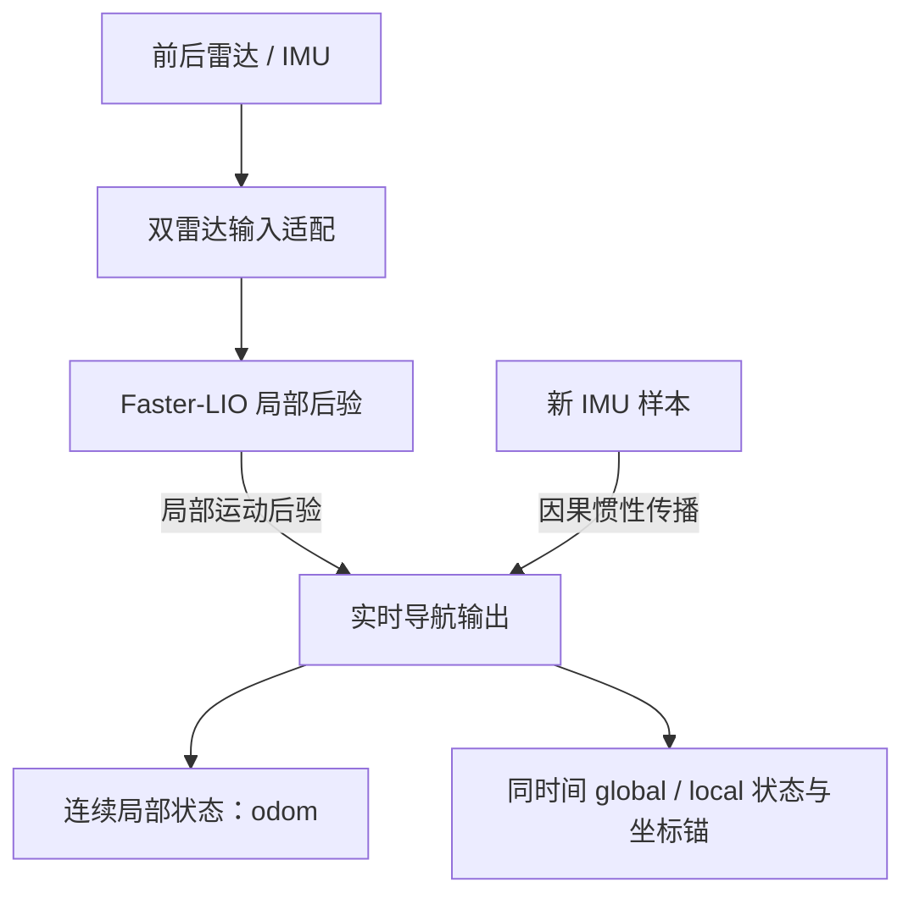
```mermaid
flowchart TB
    sensors["前后雷达 / IMU"] --> adapter["双雷达输入适配"]
    adapter --> lio["Faster-LIO 局部后验"]
    lio -->|"局部运动后验"| realtime["实时导航输出"]
    imu["新 IMU 样本"] -->|"因果惯性传播"| realtime
    realtime --> localState["连续局部状态：odom"]
    realtime --> pairedState["同时间 global / local 状态与坐标锚"]
```

地图校正链：

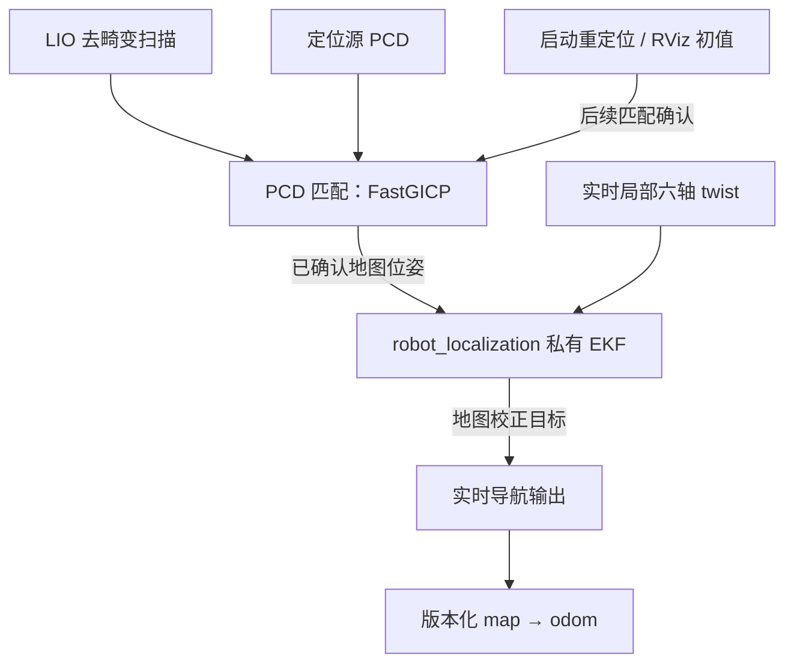
```mermaid
flowchart TB
    deskewed["LIO 去畸变扫描"] --> match["PCD 匹配：FastGICP"]
    sourceMap["定位源 PCD"] --> match
    startup["启动重定位 / RViz 初值"] -->|"后续匹配确认"| match
    match -->|"已确认地图位姿"| ekf["robot_localization 私有 EKF"]
    motion["实时局部六轴 twist"]
    motion --> ekf
    ekf -->|"地图校正目标"| realtime["实时导航输出"]
    realtime --> anchor["版本化 map → odom"]
```

Faster-LIO 负责局部运动、零偏/重力估计和去畸变；PCD 匹配提供地图绝对校正。启动重定位采用 FPFH/RANSAC 并经后续匹配确认；RViz 初值作为另一明确入口。实时节点共调度 IMU 传播与公开输出，保持一个高频输出时钟、一个公开动态 TF 写者。

私有 EKF 不发布公开 TF，也不重复融合 LIO pose、原始 IMU 和 MC。MC 用于真实运动遥测、执行反馈与停稳核验，**不是当前默认定位积分源**。50 Hz 是调度配置，不等于已证明 20 ms 硬实时。

### 3.2 控制空间

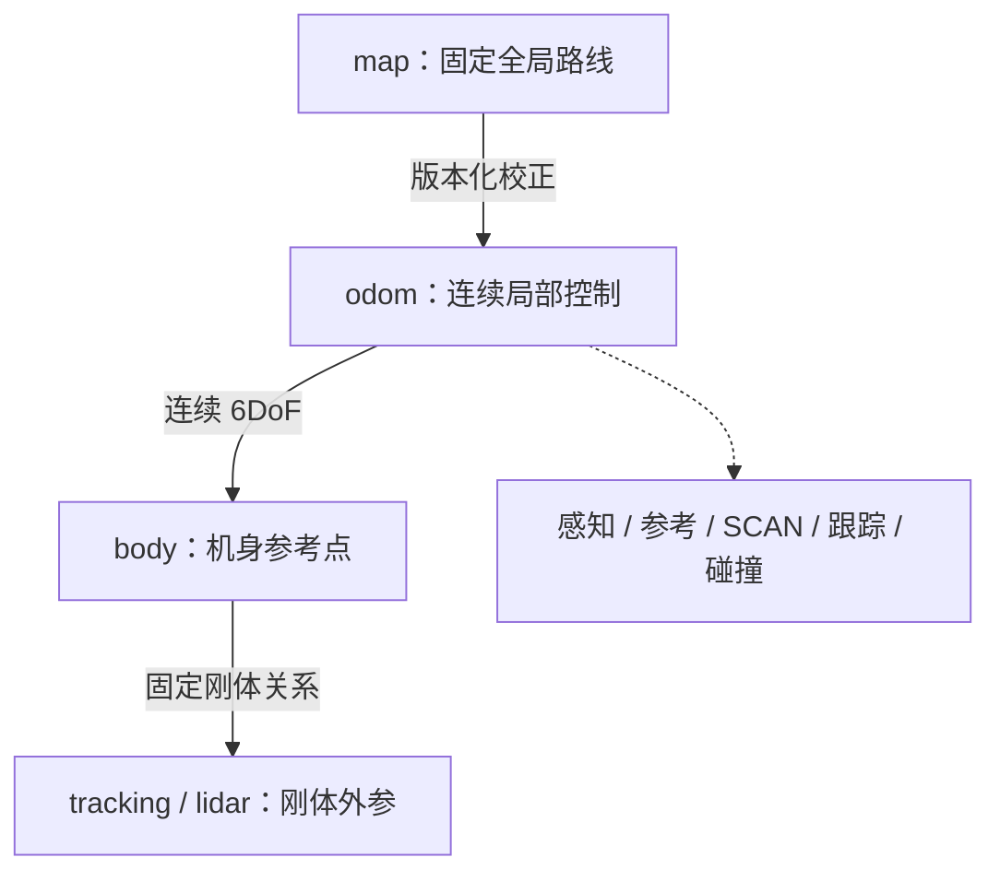
```mermaid
flowchart TB
    mapFrame["map：固定全局路线"]
    odomFrame["odom：连续局部控制"]
    bodyFrame["body：机身参考点"]
    sensorFrames["tracking / lidar：刚体外参"]
    mapFrame -->|"版本化校正"| odomFrame
    odomFrame -->|"连续 6DoF"| bodyFrame
    bodyFrame -->|"固定刚体关系"| sensorFrames
    odomFrame -.-> localConsumers["感知 / 参考 / SCAN / 跟踪 / 碰撞"]
```

实际帧为 `d1max_loc_map → d1max_loc_odom → d1max_loc_base_link`；传感器归一化使用 `d1max_loc_tracking`、`d1max_loc_lidar`。

$$
T_{map\leftarrow odom}(t)
=
T_{map\leftarrow body}(t)
\,T_{odom\leftarrow body}(t)^{-1}
$$

局部/全局状态按同一时刻配对，后验、IMU 和地图观测保留各自源时间。普通地图校正只生成新锚与参考候选，**不移动已接受曲线、不清空局部地图、不改变路线哈希**。地面目标到机身参考高度只转换一次；非刚性地图修正不能作为 TF。

### 3.3 定位地图与规划地图

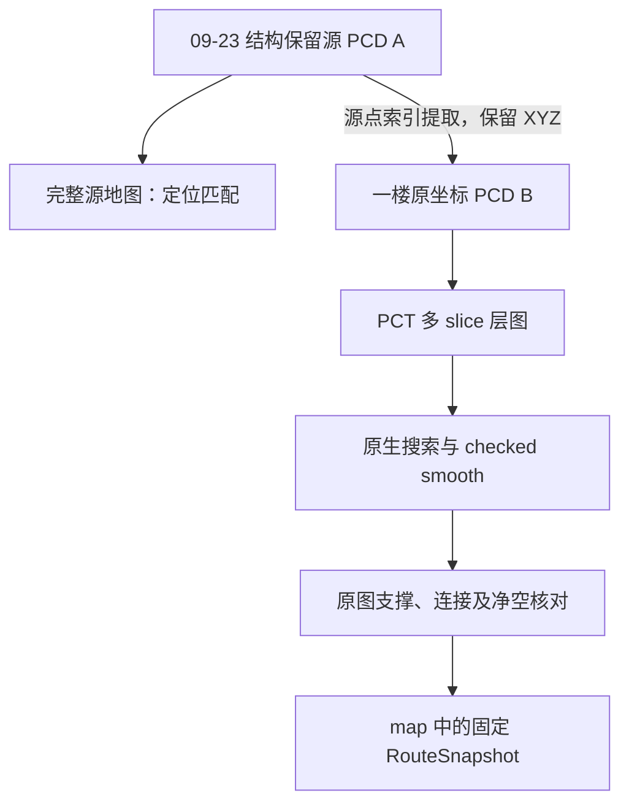
```mermaid
flowchart TB
    source["09-23 结构保留源 PCD A"]
    source --> localizationMap["完整源地图：定位匹配"]
    source -->|"源点索引提取，保留 XYZ"| planningMap["一楼原坐标 PCD B"]
    planningMap --> pct["PCT 多 slice 层图"]
    pct --> search["原生搜索与 checked smooth"]
    search --> verify["原图支撑、连接及净空核对"]
    verify --> route["map 中的固定 RouteSnapshot"]
```

`source_identity` 要求 B 的点记录等于 A 中对应源索引记录，`xyz_modified=false`，坐标误差为零。因此两者**文件不同，但同源、同坐标**；不是靠改 frame 名称对齐。

一个楼层可包含多个 PCT slice，slice 不等于楼层。旧压平跨层地图保留为历史规划预览资产，不作为当前默认运动地图；缺地面或缺净空不能凭历史行走轨迹补成可通行。

## 4. 任务身份与执行版本

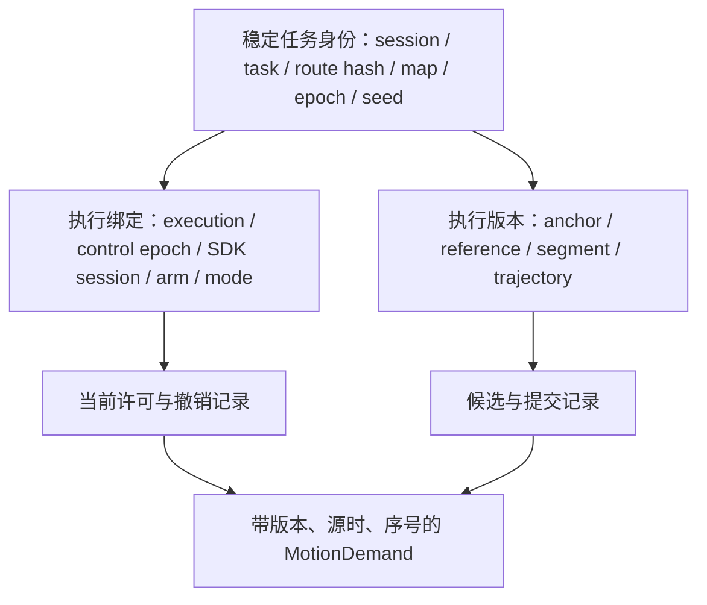
```mermaid
flowchart TB
    taskIdentity["稳定任务身份：session / task / route hash / map / epoch / seed"]
    binding["执行绑定：execution / control epoch / SDK session / arm / mode"]
    revision["执行版本：anchor / reference / segment / trajectory"]
    taskIdentity --> binding
    taskIdentity --> revision
    binding --> grant["当前许可与撤销记录"]
    revision --> preparation["候选与提交记录"]
    grant --> demand["带版本、源时、序号的 MotionDemand"]
    preparation --> demand
```

普通校正与窗口更新只改变执行版本；重新初值、LIO 重置、SDK 失权或重连撤销旧授权。writer 的 ACK/commit 计数按完整执行绑定隔离，owner 的会话级消息序号不随任务随意清零。

| 正式合同 | 表达 |
|---|---|
| `RouteSnapshot` | 路线身份、地图来源、目标、路径及路段语义 |
| `NavigationState / LocalNavigationState` | 配对全局/局部状态、连续局部状态、源时与定位身份 |
| `ReferencePath / ReferenceProposal` | 局部参考、坐标锚、窗口版本与准备事务 |
| `TaggedBspline / TrackingProgress` | 候选曲线身份、实测空间进度 |
| `TrajectoryValidation / TrajectoryAdmission` | 原生碰撞验证与跟踪器实际接入 |
| `ExecutionPermit / ExecutionHandoffGrant` | 当前执行许可与明确换轨事务 |
| `MotionDemand / MotionValidation` | 实际运动需求及对应运动扫掠证据 |
| `ExecutionCommitAck / StopReport` | 实际应用事实、停止提交和实测停稳的分别表达 |

`nav_msgs/Path`、裸 `Twist` 和诊断 JSON 用于显示或兼容，不能独立授权运动。

## 5. 局部参考、换轨与连续跟踪

### 5.1 固定路线到局部窗口

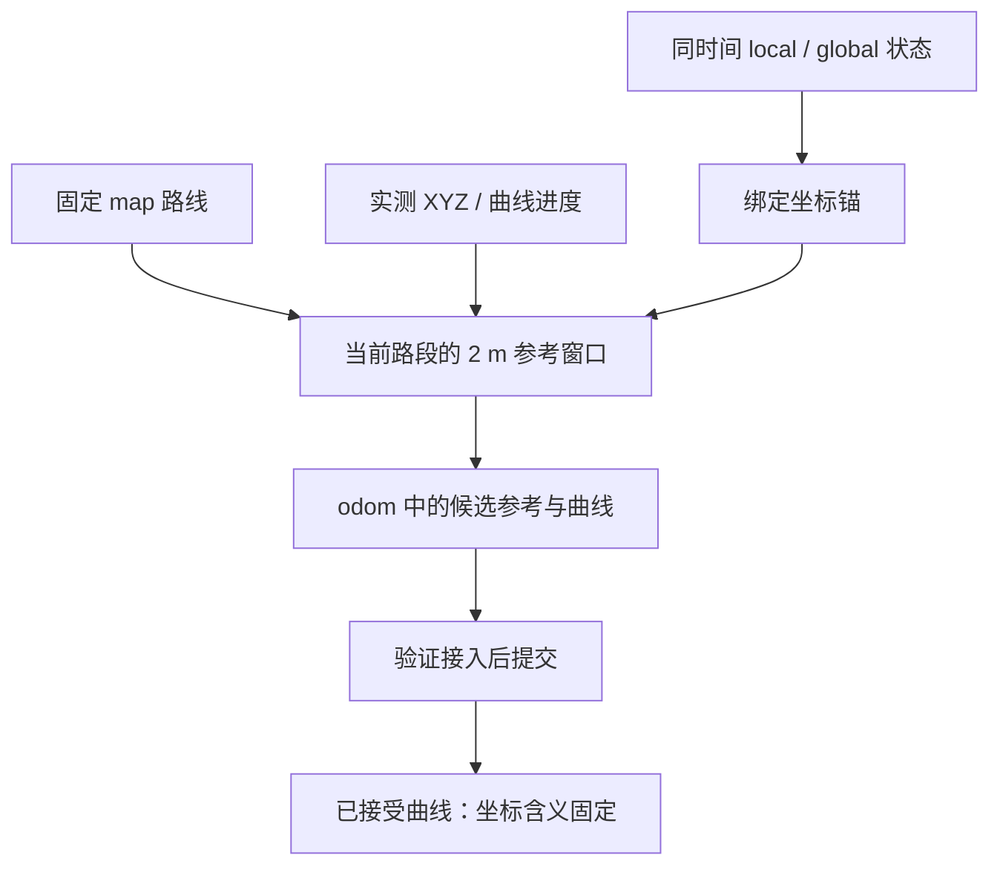
```mermaid
flowchart TB
    route["固定 map 路线"] --> window["当前路段的 2 m 参考窗口"]
    progress["实测 XYZ / 曲线进度"] --> window
    pairedState["同时间 local / global 状态"] --> boundAnchor["绑定坐标锚"]
    boundAnchor --> window
    window --> candidate["odom 中的候选参考与曲线"]
    candidate --> commit["验证接入后提交"]
    commit --> accepted["已接受曲线：坐标含义固定"]
```

进度区分两种量：**实测曲线位置**允许小幅倒退；**已确认进度高水位**单调推进。投影限定当前路段与空间窗口，不能因另一层或另一分支的 XY 更近而跳段。

### 5.2 候选—验证—提交

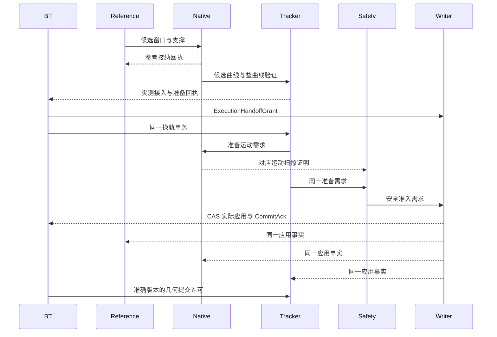
```mermaid
sequenceDiagram
    participant BT
    participant Reference
    participant Native
    participant Tracker
    participant Safety
    participant Writer
    Reference->>Native: 候选窗口与支撑
    Native-->>Reference: 参考接纳回执
    Native->>Tracker: 候选曲线与整曲线验证
    Tracker-->>BT: 实测接入与准备回执
    BT->>Writer: ExecutionHandoffGrant
    BT->>Tracker: 同一换轨事务
    Tracker->>Native: 准备运动需求
    Native-->>Safety: 对应运动扫掠证明
    Tracker->>Safety: 同一准备需求
    Safety->>Writer: 安全准入需求
    Writer-->>BT: CAS 实际应用与 CommitAck
    Writer-->>Reference: 同一应用事实
    Writer-->>Native: 同一应用事实
    Writer-->>Tracker: 同一应用事实
    BT->>Tracker: 准确版本的几何提交许可
```

BT 的准确提交许可也分发到参考管理器、原生验证器和安全出口。图表示后续换轨；首次安装使用独立的初次提交回执合同。

已接受曲线与候选分开保存。新候选失败或迟到，不清除仍安全的当前曲线；当前曲线证据失效时才撤销其运动依据。prepared 快照有界保存，候选投影失败不能抹掉 native/writer 已接纳的事实。

`Applied` 是历史事实，许可是当前权利。迟到回执可按原授权区间对账，**不能刷新源时间、碰撞证据或恢复已撤授权**。曲线因 HOLD 撤下后，“版本相同”不代表“仍已安装”；恢复需新的验证、实际接入及新鲜 BT 许可。

### 5.3 跟踪控制闭环

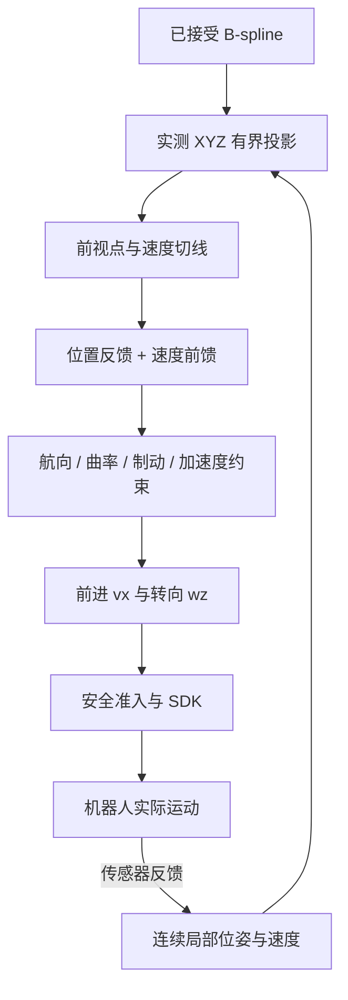
```mermaid
flowchart TB
    trajectory["已接受 B-spline"] --> projection["实测 XYZ 有界投影"]
    measured["连续局部位姿与速度"] --> projection
    projection --> target["前视点与速度切线"]
    target --> control["位置反馈 + 速度前馈"]
    control --> limits["航向 / 曲率 / 制动 / 加速度约束"]
    limits --> demand["前进 vx 与转向 wz"]
    demand --> sdk["安全准入与 SDK"]
    sdk --> robot["机器人实际运动"]
    robot -->|"传感器反馈"| measured
```

控制器按实测空间进度推进，不按墙钟播放曲线。运动方向投影到机身 X，首版输出非负前进与转向；需要原地对齐时先停车，并验证旋转包络。换轨保留限速器历史，重新核验当前位置与速度；没有可信加速度测量，不宣称实测 C2 连续。

## 6. 独立感知与最终运动依据

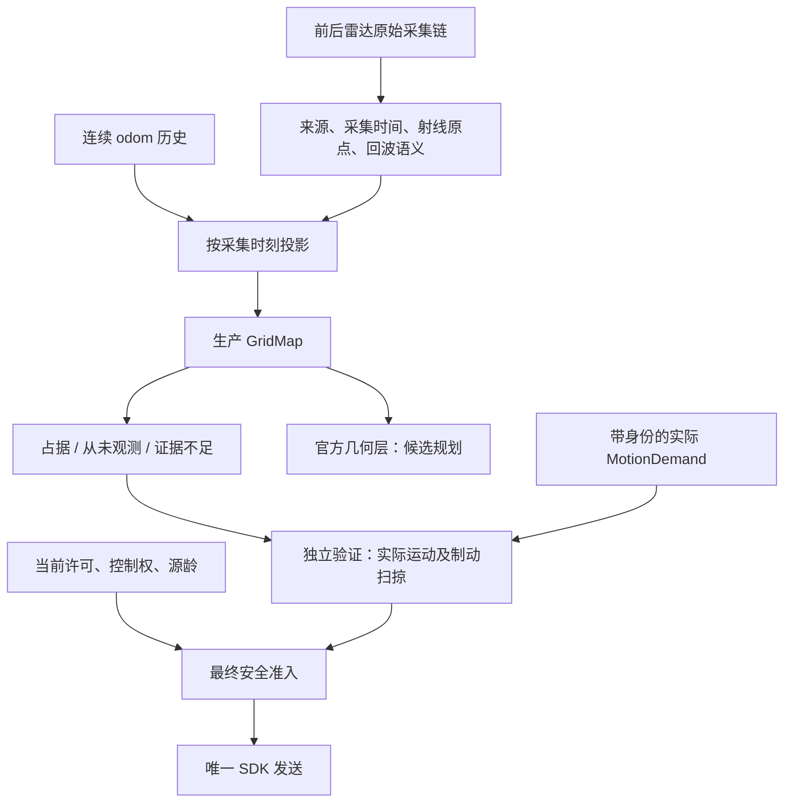
```mermaid
flowchart TB
    raw["前后雷达原始采集链"] --> rays["来源、采集时间、射线原点、回波语义"]
    history["连续 odom 历史"] --> projection["按采集时刻投影"]
    rays --> projection
    projection --> grid["生产 GridMap"]
    grid --> evidence["占据 / 从未观测 / 证据不足"]
    grid --> planning["官方几何层：候选规划"]
    evidence --> sweep["独立验证：实际运动及制动扫掠"]
    motion["带身份的实际 MotionDemand"] --> sweep
    permit["当前许可、控制权、源龄"] --> safety["最终安全准入"]
    sweep --> safety
    safety --> writer["唯一 SDK 发送"]
```

安全采集不经过 LIO 的点筛选，也不继承预览近身删点框。实体自体滤除、安全包络和可观测性分别建模；不能用扩大清除盒替代轮腿/载荷测量。

体素证据区分**确定占据、从未观测、已观测但证据不足**。SCAN 官方几何层生成曲线，**不等于裸曲线即可执行**。最终验证限定实际运动与制动扫掠范围，不要求无关区域全部可见，也不将全部未知空间当 free。同体素同时保留唯一计数与原始重叠证据，便于定位误阻塞来源。

## 7. 暂停、恢复、取消与到达

### 7.1 一个任务的状态转换

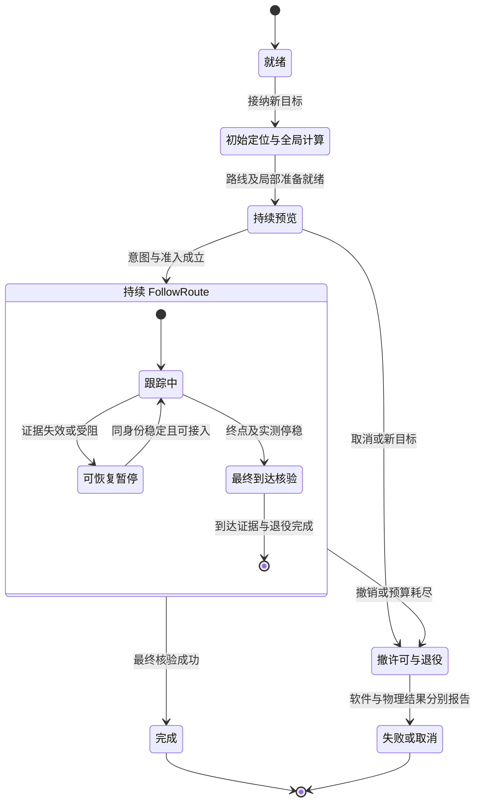
```mermaid
stateDiagram-v2
    direction TB
    state "就绪" as Ready
    state "初始定位与全局计算" as Preparing
    state "持续预览" as Preview
    state "持续 FollowRoute" as Following {
        state "跟踪中" as Tracking
        state "可恢复暂停" as Holding
        state "最终到达核验" as Arrival
        [*] --> Tracking
        Tracking --> Holding: 证据失效或受阻
        Holding --> Tracking: 同身份稳定且可接入
        Tracking --> Arrival: 终点及实测停稳
        Arrival --> [*]: 到达证据与退役完成
    }
    state "撤许可与退役" as Retiring
    state "完成" as Completed
    state "失败或取消" as Ended

    [*] --> Ready
    Ready --> Preparing: 接纳新目标
    Preparing --> Preview: 路线及局部准备就绪
    Preview --> Following: 意图与准入成立
    Following --> Completed: 最终核验成功
    Preview --> Retiring: 取消或新目标
    Following --> Retiring: 撤销或预算耗尽
    Retiring --> Ended: 软件与物理结果分别报告
    Completed --> [*]
    Ended --> [*]
```

| 事件 | 路线 / 任务 | 当前运动 |
|---|---|---|
| 普通地图校正、窗口更新 | 保持身份与 route hash | 新候选通过交接后替换 |
| 新候选失败 | 保留任务及安全当前曲线 | 当前曲线仍有效则继续 |
| 当前曲线碰撞或源龄失效 | 保留任务与路线 | 停止使用失效曲线，进入暂停 |
| 同身份证据恢复 | 不重算全局路线 | 新样本稳定、实测接入后恢复 |
| 持续受阻或恢复超时 | 结束本次尝试，路线留作显示 | 不自行改全局路线 |
| 定位重置、SDK 失权或重连 | 撤销旧授权 | 不自动抢权或复活旧指令 |

恢复窗口为 **0.6 s 且至少 3 个新的有效样本**。重复旧消息和心跳不能满足恢复条件，也不能无限刷新 30 s 恢复预算；安全停止不等待稳定窗口。

### 7.2 停止不是一个布尔值

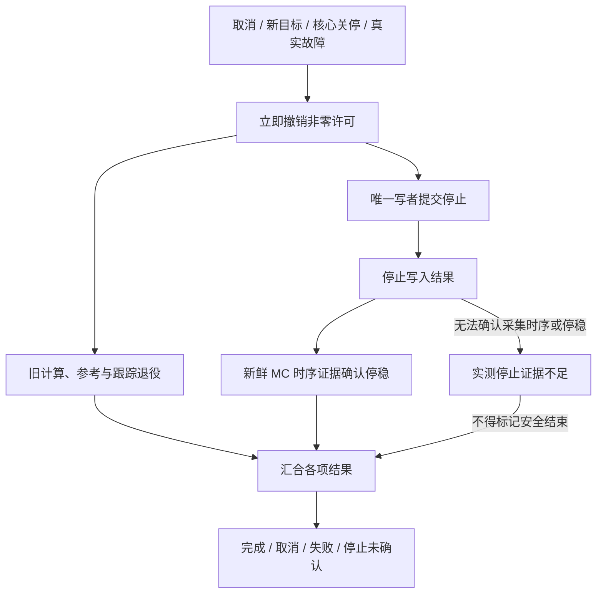
```mermaid
flowchart TB
    event["取消 / 新目标 / 核心关停 / 真实故障"]
    event --> revoke["立即撤销非零许可"]
    revoke --> stop["唯一写者提交停止"]
    revoke --> retire["旧计算、参考与跟踪退役"]
    stop --> writerAck["停止写入结果"]
    writerAck --> measuredStop["新鲜 MC 时序证据确认停稳"]
    writerAck -->|"无法确认采集时序或停稳"| uncertain["实测停止证据不足"]
    retire --> result["汇合各项结果"]
    measuredStop --> result
    uncertain -->|"不得标记安全结束"| result
    result --> outcome["完成 / 取消 / 失败 / 停止未确认"]
```

停止提交与软件退役可并行，但必须分别报告。零速度发送、取消 ACK、曲线走完都不等于实测停稳；MC 需核对原始采集时间与 SDK 会话，不能用“停止后收到”代替“停止后采集”。

终点采用 XY ≤0.20 m、Z ≤0.15 m、可选朝向约 10°，实测停稳持续 1 s。停稳后匹配全局到达证据最多等待 4 s；缺证据明确退役，不无限等待，也不再次运动追逐校正后的终点。

正常关停先 BT drain，再退出执行依赖，最后关闭 SDK/通信。显示端退出不触发此流程。软件指令租约不是实际制动时间，断指令与断网停止仍需物理核验。

## 8. 调度与资源隔离

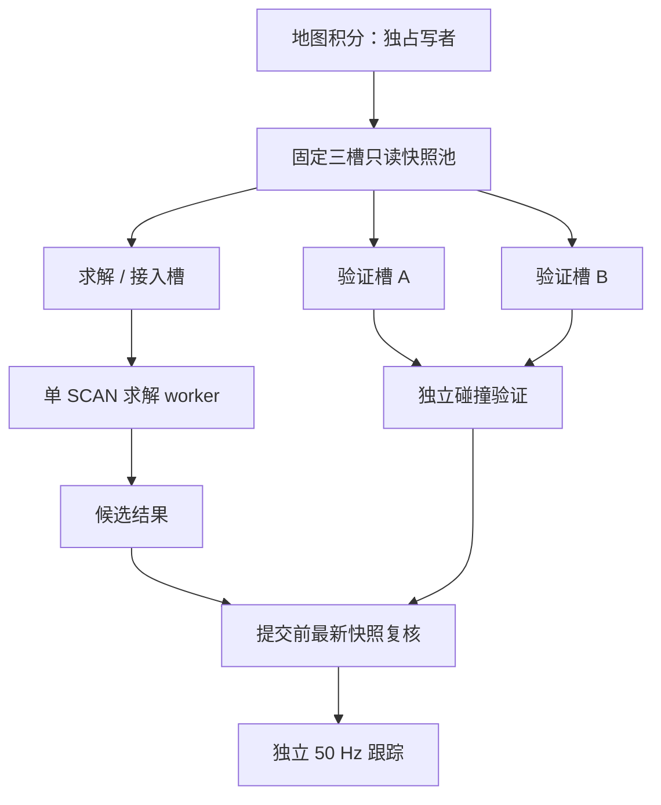
```mermaid
flowchart TB
    mapWriter["地图积分：独占写者"] --> pool["固定三槽只读快照池"]
    pool --> validationA["验证槽 A"]
    pool --> validationB["验证槽 B"]
    pool --> solverSlot["求解 / 接入槽"]
    validationA --> validation["独立碰撞验证"]
    validationB --> validation
    solverSlot --> worker["单 SCAN 求解 worker"]
    worker --> candidate["候选结果"]
    candidate --> latest["提交前最新快照复核"]
    validation --> latest
    latest --> tracker["独立 50 Hz 跟踪"]
```

快照借出期间不覆盖，资源不足有界等待，不无限分配；查询缓存由读者独占。400 ms 是整轮共享期限，覆盖取目标、取快照、搜索、优化和提交前处理，内部重试不重新获得预算。取消与停止不排在长求解后。

| 环节 | 当前配置 / 调度 |
|---|---|
| 连续状态、跟踪器 | 50 Hz / 20 ms |
| BT | 10 Hz |
| GridMap 积分 | 5 Hz |
| 独立原生验证、SDK 写者 | 20 Hz |
| SCAN | 单 worker，重试冷却 0.5 s，整轮 400 ms |
| 地图显示 | ≤3 Hz |
| 局部地图 / 参考窗口 | 8×8×3 m，5 cm / 2 m |
| 首版速度 / 转向 | ≤0.30 m/s / ≤0.50 rad/s |
| 线 / 角加速度 | ≤0.35 m/s² / ≤0.80 rad/s² |
| 全局计算 / worker 预热 | 10 s / 60 s |
| 共用恢复 episode | 30 s |

以上是**配置目标，不是实测性能**。全局规划使用常驻预热 worker；端到端耗时应分别统计搜索、平滑、支撑验证和通信。硬实时、P95/P99、内存长期增长及 NUC 资源预算尚未验收。

## 9. 运行包、可视化与能力边界

### 9.1 唯一主线的加载闭合

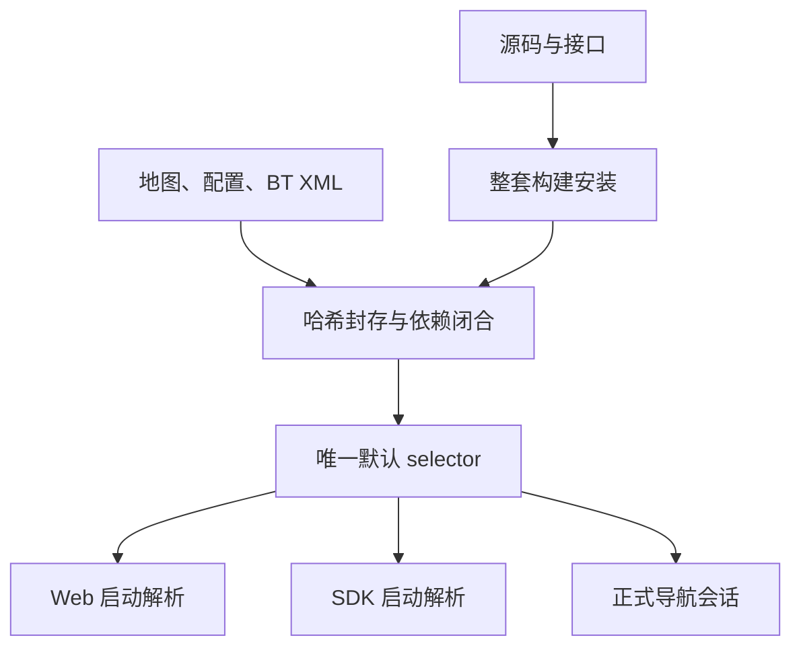
```mermaid
flowchart TB
    source["源码与接口"] --> build["整套构建安装"]
    config["地图、配置、BT XML"] --> seal["哈希封存与依赖闭合"]
    build --> seal
    seal --> selector["唯一默认 selector"]
    selector --> web["Web 启动解析"]
    selector --> sdk["SDK 启动解析"]
    selector --> session["正式导航会话"]
```

公开入口是 `navigation_session`；旧 `single_floor_session` 是同一实现的兼容名。实际运行需同时核对源码快照、安装文件、ELF、接口、生成参数、XML 和地图，不以“发布仓库改过”代替已加载。

当前只用一个 RViz 进程：全局视图显示楼层/可通行面、固定路线、XYZ 目标和机器人坐标轴；局部视图显示滑动地图、参考窗口、跟踪点、已接受曲线和包络。候选和历史曲线不能冒充执行轨迹；Marker ID 稳定，显示刷新不触发规划或取消。

### 9.2 跨楼层扩展边界

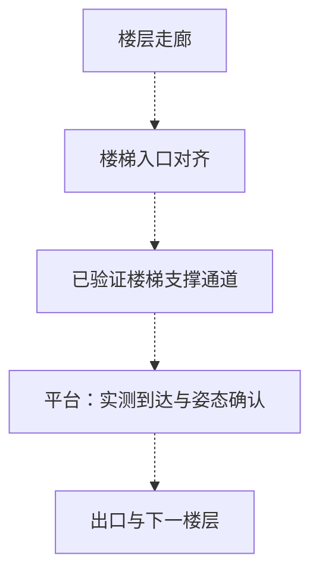
```mermaid
flowchart TB
    floorA["楼层走廊"] -.-> entry["楼梯入口对齐"]
    entry -.-> stairs["已验证楼梯支撑通道"]
    stairs -.-> landing["平台：实测到达与姿态确认"]
    landing -.-> exit["出口与下一楼层"]
```

虚线表示跨层执行扩展，**不表示当前已验收**。楼梯不是仅有 Z 的 XY 曲线：需要路段语义、上下楼能力、模式事务、支撑边界及各模式停止策略。Z 用于支撑与进度核验，不生成 SDK 未支持的垂直速度。

| 范围 | 当前结论 |
|---|---|
| BT、连续定位、参考、原生 SCAN、跟踪与 SDK 合同 | 已软件接入默认主线并完成构建/文件一致性检查 |
| 一楼运动、动态绕障、取消与停稳 | 尚未完成整链实机验收；当前 Web 仅规划 |
| 跨层规划预览 | 保留已有资产和能力，不等于跨层运动完成 |
| 楼梯自主执行、室外泛化、NUC 部署 | 需独立能力与性能验收 |

物理缺项：雷达测量原点与外参、机身参考高度、轮腿/载荷及转向包络、SDK 速度比例、MC 源时关系、各模式制动与断网停止。约 50 cm 的测量线索不当作精确标定，未验收标志保持未验收。

## 10. 实现依据

> [!info]- 当前主线依据
> - [行为树与任务生命周期](/home/dndx/d1max_nav_ws/docs/design/NAVIGATION_TASK_LIFECYCLE.md)
> - [实际会话装配](/home/dndx/d1max_nav_ws/src/d1max_pct_scan/d1max_pct_scan/single_floor_session.py)
> - [连续参考交接](/home/dndx/d1max_nav_ws/src/d1max_pct_scan/d1max_pct_scan/continuous_reference_node.py)
> - [原生验证合同](/home/dndx/d1max_nav_ws/src/scan_planner_vendor/plan_manage/include/plan_manage/execution_validator.hpp)
> - [跟踪核心](/home/dndx/d1max_nav_ws/src/d1max_trajectory_tracker/include/d1max_trajectory_tracker/tracker_core.hpp)
> - [默认运行状态与核对方法](/home/dndx/d1max_nav_ws/docs/status/PROJECT_TAKEOVER_STATUS_20260928.md)
> - 本次文档依据代码、有效参数与封存包；没有新增实机或录包验收结论。

关联：[[D1 Max 当前定位方案]] · [[D1 Max 坐标系与地图倾斜系统梳理]] · [[D1 Max 从原始 PCD 到 PCT 全局规划的完整处理流程]] · [[机器狗多楼层建图导航方案]]
