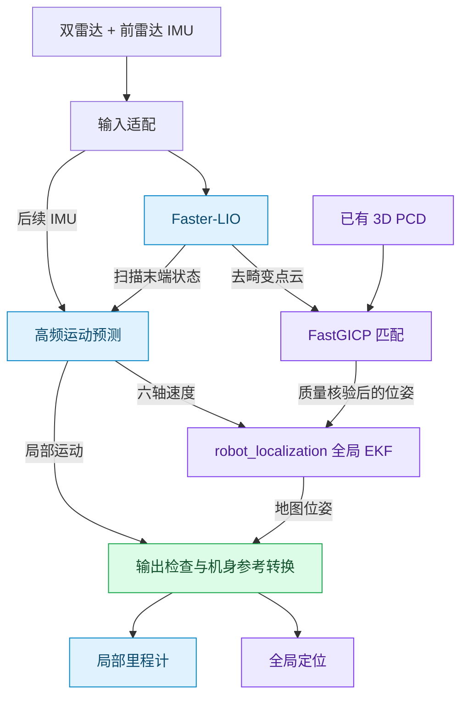

# D1 Max 当前定位方案

> [!abstract] 先记住这句话
> **LIO 管“刚才走了多少”，PCD 匹配管“现在在地图哪里”。**
> 高频预测把两次雷达更新之间的运动接起来，全局滤波再把地图校正融进去。

当前默认：`lio_pcd` · 通信：`Zenoh` · 核对日期：2026-09-17

## ① 定位是怎么串起来的

- **快的一路**：LIO 随有效扫描修正；用新的 IMU 做短时预测，公开输出目标 **50 Hz**，不是点云匹配 50 Hz。
- **慢的一路**：实时点云与已有 PCD 匹配，修正局部累计误差；不是重新建图，也不是 SC-PGO 回环。
- **MC 速度**：`OnMcData` 仍用于遥测和频率监测，当前默认链路**不拿它积分位置**，也不是旧的 MC 双 EKF。

## ② 我怎么使用

**Web 负责管理，后台负责计算，Foxglove 负责显示。**

`ws://127.0.0.1:8769` 是本机可视化桥接地址，不是机器狗地址。画箭头只是给匹配一个起点，不等于定位已经成功。

> [!tip] 做 2D 导航，定位仍然用 3D
> 同一地图版本的 `localization.pcd` 用于点云匹配；2D 栅格用于规划。不能用一张 2D 图替代匹配用的 PCD。

## ③ 地图校正放在哪里

实际坐标名前缀为 `d1max_loc_`；归一化后的 `lidar` 与 `tracking` 重合。公开动态 TF 由**统一输出层**发布。

**地图纠偏放在 `map → odom`，不直接改写局部 odom。** 局部控制看连续运动，全局规划看地图位置；2D 导航也保留真实高度和俯仰，不把点云压平。

话题统一前缀：`/d1max/localization/`

| 接口 | 看什么 / 给谁用 |
|---|---|
| `odometry/local` | odom 中的机身位姿，供后续局部控制使用 |
| `odometry/global` | map 中的机身位姿，供全局导航使用 |
| `pose` / `trajectory` | Foxglove 的雷达参考点箭头与轨迹，不是机身中心 |
| `navigation/status` | 数据是否有效、实际频率、数据龄与故障 |

> [!warning] 能看到，不等于已验收
> 50 Hz 是配置目标，不是实测保证。断流或超时会停止有效输出，Foxglove 仍可能留着旧画面。
> 本次核对的会话外参、时间对齐验收标志仍为 `false`；不能据此认定已可稳定高速导航。

关联：[[D1 Max 坐标系与地图倾斜系统梳理]] · [[D1 Max 无回环建图稳定性验证]] · [[机器狗多楼层建图导航方案]]

> [!info]- 实现依据，排查时再展开
> - [定位架构说明](/home/dndx/d1max_nav_ws/src/d1max_localization/NAVIGATION_ESTIMATION.md)
> - [统一配置模板](/home/dndx/d1max_nav_ws/src/d1max_localization/config/localization.yaml)
> - [模块启动关系](/home/dndx/d1max_nav_ws/src/d1max_localization/launch/localization.launch.py)
> - 核对会话：`950df2abc4e245ca83b73b7bf29e3f07`。Web 启动时保存独立配置快照，模板修改不会自动替换已有会话。
