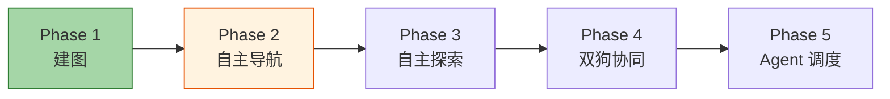
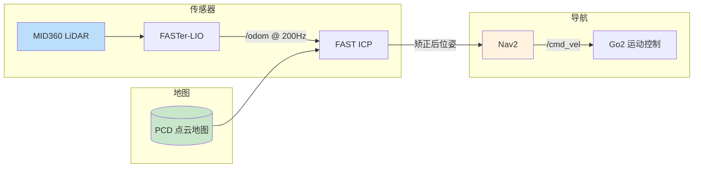
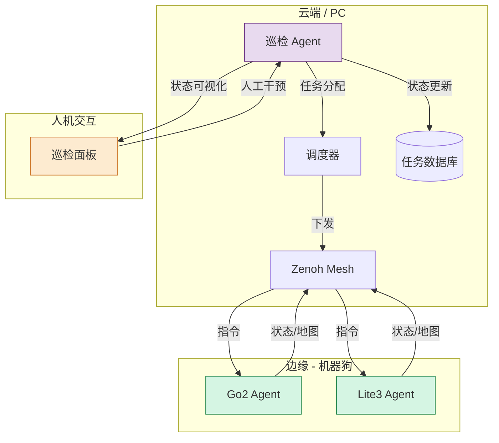

# 多机器狗巡检 — 实施计划

> [!abstract] 当前状态
> Phase 1 建图已完成，进入 Phase 2 自主导航阶段。



---

## Phase 1: 建图 ✅

> [!success] 已完成
> 基础设施全部就绪，PCD 已实现自动校平。

| 项目 | 状态 | 说明 |
|------|------|------|
| Go2 + MID360 驱动 | ✅ 完成 | Livox ROS Driver 2 |
| FASTer-LIO 建图 | ✅ 完成 | ROS2 移植、PCD 自动校平[^1] |
| PCD → PGM | ✅ 完成 | pcd2pgm 包 + 自动命名脚本 |
| 点云可视化 | ✅ 完成 | PLY 导出 + CloudCompare |

[^1]: 详见 [[收集箱/FASTer-LIO PCD倾斜问题排查与解决方案]]

---

## Phase 2: 自主导航 ⏳

> [!warning] 当前阶段
> 核心目标是实现 **Go2 在已知地图上的自主导航**。

### 2.1 定位方案



> [!quote] 定位思路
> FASTer-LIO 提供 **高频 /odom（200Hz）** 作为初值，
> FAST ICP **每帧 LiDAR 扫描** 与 PCD 地图匹配做**全局矫正**，
> 同时避免纯 FASTer-LIO 的 ==累积漂移== 和纯 ICP 的 ==初值敏感==。 ^loc-strategy

### 2.2 Nav2 导航栈

| 模块 | 组件 | 说明 |
|------|------|------|
| 全局规划 | Nav2 Planner（A*/Navfn） | 全局路径 |
| 局部规划 | Nav2 Controller（DWB） | 实时避障 |
| **定位** | **FAST ICP**（替代 AMCL） | 3D 点云地图匹配 |
| 代价地图 | costmap_2d | 2D 障碍物层 |
| 控制接口 | `/cmd_vel` → Go2 SDK | 狗的运动控制 |

### 2.3 实现步骤

- [ ] **FAST ICP 定位节点** — 加载 PCD、订阅 `/livox/lidar` + `/odom`、发布矫正位姿
- [ ] **Go2 运动控制桥接** — 通过 unitree_ros2 或 unitree_sdk2 桥接 `/cmd_vel`
- [ ] **Nav2 配置与调参** — 代价地图、规划器、控制器参数适配机器狗
- [ ] **定点巡检测试** — 预设目标点，验证导航精度与稳定性

---

## Phase 3: 自主探索 🌐

> [!info]
> 在已知地图基础上，自动规划 ==未探索区域== 的路径，扩展地图覆盖率。

### 技术选型

| 方法 | 说明 |
|------|------|
| **frontier_exploration** | 基于前沿边界的探索，ROS 成熟方案 |
| 自定义探索策略 | 结合巡检任务需求，优先探索待检区域 |

### 实现步骤

- [ ] 探索边界检测与聚类
- [ ] 探索目标点选取策略
- [ ] 探索路径规划与重规划
- [ ] Lite3 + 雷神 C16 雷达部署

---

## Phase 4: 双狗协同 🤖🤖

> [!tip] 双平台
> **Go2（MID360）** + **Lite3（雷神 C16）** 协同建图与巡检。

### 通信架构

基于已部署的 **Zenoh Mesh**，实现狗↔狗、狗↔PC 实时数据交换。[[ROS2 Zenoh 通信架构详解]]

### 协同策略

| 策略 | 说明 |
|------|------|
| **分布式建图** | 各狗独立建图，云端融合 |
| **协同巡检** | 区域分割，各自负责 |
| **任务接力** | 电量低时交接任务 |
| **互相对齐** | 相遇时校正地图偏差 |

### 实现步骤

- [ ] Lite3 + 雷神 C16 雷达部署与驱动
- [ ] 双狗 Zenoh Mesh 通信联调
- [ ] 增量地图融合算法
- [ ] 协同任务分配策略开发
- [ ] 实机联调测试

---

## Phase 5: Agent 调度 🧠

> [!quote] 最终目标
> 引入 AI Agent 层，实现巡检任务的智能描述、自动分配和动态调度。

### 架构



### Agent 能力

| 能力 | 说明 |
|------|------|
| **任务规划** | 根据巡检区域自动分配 |
| **异常检测** | 实时监控狗的状态 %%包括电量、故障、定位丢失%% |
| **动态重规划** | 故障/低电量时调整任务 |
| **人机交互** | 任务下发、状态查看、人工接管 |

### 实现步骤

- [ ] Agent 框架设计（基于 LangChain / 自定义）
- [ ] 巡检任务描述语言定义
- [ ] 机器狗状态上报与监控
- [ ] 动态调度与冲突解决
- [ ] 巡检面板（Web 前端）

---

## 时间线

```
Phase 1  建图             ████████████████████████░░░░░░░░░░░  已完成
Phase 2  自主导航          ░░░░░░░░░░░░░░░░░░░░░░░░░░░░░░░░░░░  当前
Phase 3  自主探索          ░░░░░░░░░░░░░░░░░░░░░░░░░░░░░░░░░░░
Phase 4  双狗协同          ░░░░░░░░░░░░░░░░░░░░░░░░░░░░░░░░░░░
Phase 5  Agent 调度       ░░░░░░░░░░░░░░░░░░░░░░░░░░░░░░░░░░░
```

%% 时间线预计：Phase 2 两周，Phase 3 三周，Phase 4 四周，Phase 5 四周 %%

---

## 相关笔记

- [[项目/多机器狗巡检]] — 项目总览
- [[项目/多机器狗巡检-实施计划]] — （当前文档）
- [[收集箱/FASTer-LIO PCD倾斜问题排查与解决方案]] — FASTer-LIO 部署与校平
- [[收集箱/Livox Mid-360 激光雷达部署]] — MID360 驱动部署
- [[ROS2 Zenoh 通信架构详解]] — 通信中间件

> [!note] 更新记录
> - 2026-07-01：创建，Phase 1 标记完成
