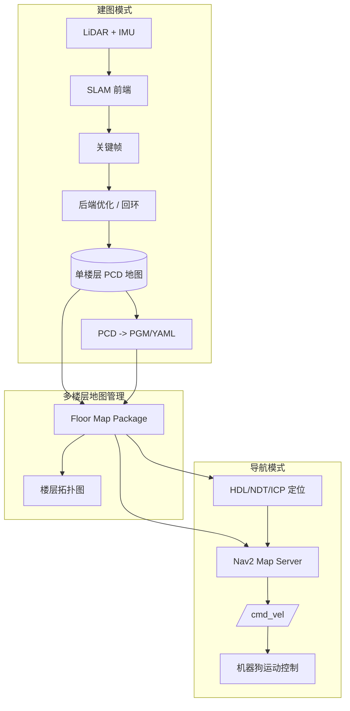
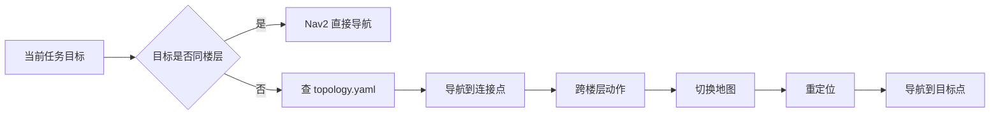

# 机器狗多楼层建图导航方案

> 面向机器狗在楼宇环境中的多楼层建图、定位、导航和巡检。当前系统已具备 Lite3 /Go2单层已知地图导航能力，下一阶段目标是补齐 SLAM 后端、楼层地图管理和跨楼层任务切换。

---

## 一、项目目标

构建一套支持多楼层环境的机器狗建图与导航系统，使机器狗能够：

- 在单楼层内完成稳定 3D 建图和 2D 导航地图生成
- 在已建地图中进行可靠重定位和自主导航
- 管理多个楼层的 PCD、PGM/YAML、语义点位和巡检路线
- 在电梯、楼梯口、坡道等楼层连接点处执行地图切换
- 为后续多狗协同巡检提供统一地图资产和任务接口

当前阶段不建议直接把所有楼层塞进一张大地图。推荐采用：

```text
单楼层独立建图 + 楼层拓扑图 + 运行时地图切换
```

---

## 二、现状判断

目前系统能力：

| 能力 | 当前状态 | 说明 |
|------|----------|------|
| 雷达输入 | 已具备 | Lite3 使用雷神 C16，Go2 使用 MID360 |
| 单层导航 | 已跑通 | Lite3 已完成 Nav2 + HDL Localization 导航链路 |
| PCD 定位 | 已具备 | HDL Localization/NDT 可基于 PCD 定位 |
| 2D 栅格地图 | 已具备 | PGM/YAML 可供 Nav2 map_server 使用 |
| SLAM 前端 | 已具备 | 当前更偏前端里程计/局部建图能力 |
| SLAM 后端 | 待补齐 | 缺关键帧、回环检测、位姿图优化 |
| 多楼层管理 | 待设计 | 需要地图包结构、楼层切换和拓扑关系 |

核心问题：

```text
只有前端 SLAM 时，长走廊、回环和跨区域建图会累计漂移。
多楼层场景必须引入后端优化和地图资产管理。
```

---

## 三、总体架构



系统分为三层：

| 层级 | 作用 |
|------|------|
| 建图层 | 负责生成每层 PCD 和 2D 栅格地图 |
| 地图管理层 | 管理楼层地图、连接点、巡检点和版本 |
| 导航层 | 根据当前楼层加载对应地图并执行导航 |

---

## 四、技术路线

### 4.1 SLAM 前端

前端负责实时估计短时间内的运动轨迹，并生成局部点云约束。

候选方案：

| 方案 | 优点 | 风险 | 建议 |
|------|------|------|------|
| FAST-LIO / FASTer-LIO | 速度快，适合 MID360 | 本身后端弱，长距离漂移 | 可作为前端 |
| LIO-SAM | 因子图后端成熟，有 GPS/IMU/回环扩展 | 对传感器和 IMU 标定要求高 | 推荐评估 |
| KISS-ICP | 简洁、易部署 | 不依赖 IMU，复杂运动下可能弱 | 可做对照实验 |
| HDL Graph SLAM | 与 HDL 定位体系接近 | 工程集成成本较高 | 可作为后端参考 |

短期建议：

```text
FASTer-LIO / FAST-LIO 作为前端
补充 Scan Context 回环 + Pose Graph Optimization
```

### 4.2 SLAM 后端

后端必须解决：

- 关键帧选择
- 局部子图构建
- 回环检测
- 回环约束计算
- 位姿图优化
- 优化后地图重建

推荐模块：

| 功能 | 推荐 |
|------|------|
| 回环检测 | Scan Context / LiDAR-Iris |
| 图优化 | GTSAM / g2o |
| 子图保存 | Keyframe PCD + pose graph |
| 地图导出 | optimized poses + keyframes 合成 PCD |

### 4.3 导航定位

建图完成后，导航不直接跑 SLAM，而使用定位模式：

```text
当前 LiDAR scan -> PCD 地图匹配 -> map -> base_link -> Nav2
```

当前 Lite3 已采用：

- HDL Localization
- NDT_OMP
- PCD 地图
- Nav2 map_server 加载 PGM/YAML

后续可保留这一模式，只把“单张地图”扩展成“按楼层加载地图”。

---

## 五、多楼层地图资产设计

建议建立统一地图目录：

```text
system/maps/building_a/
├── building.yaml
├── topology.yaml
├── floor_01/
│   ├── floor.yaml
│   ├── map.pcd
│   ├── map.pgm
│   ├── map.yaml
│   ├── keyframes/
│   ├── graph.g2o
│   └── waypoints.yaml
├── floor_02/
│   ├── floor.yaml
│   ├── map.pcd
│   ├── map.pgm
│   ├── map.yaml
│   ├── keyframes/
│   ├── graph.g2o
│   └── waypoints.yaml
└── transitions/
    ├── elevator_a.yaml
    └── stair_ east.yaml
```

### `building.yaml`

```yaml
building_id: building_a
name: 实验楼
default_floor: floor_01
floors:
  - floor_01
  - floor_02
map_version: 2026-07-12
```

### `floor.yaml`

```yaml
floor_id: floor_01
name: 一层
pcd: map.pcd
grid_map: map.yaml
frame_id: map_floor_01
resolution: 0.05
origin: [0.0, 0.0, 0.0]
```

### `topology.yaml`

```yaml
transitions:
  - id: elevator_a_1_to_2
    type: elevator
    from_floor: floor_01
    to_floor: floor_02
    from_pose: [12.4, 3.1, 1.57]
    to_pose: [11.8, 2.9, 1.57]

  - id: stair_east_1_to_2
    type: stair
    from_floor: floor_01
    to_floor: floor_02
    from_pose: [20.2, -4.0, 0.0]
    to_pose: [19.6, -3.7, 0.0]
```

### `waypoints.yaml`

```yaml
waypoints:
  - id: fire_box_01
    name: 消防箱 01
    pose: [3.2, 1.5, 0.0]
    task: image_capture

  - id: meter_room
    name: 配电室门口
    pose: [8.4, -2.1, 1.57]
    task: thermal_check
```

---

## 六、跨楼层导航策略

跨楼层任务不应由 Nav2 在一张地图里直接规划，而由上层任务管理器拆解。

示例任务：

```text
从 floor_01 的 A 点巡检到 floor_02 的 B 点
```

拆解为：

1. 当前楼层导航到连接点，例如电梯口
2. 执行跨楼层动作，例如进电梯、等待、出电梯
3. 切换当前楼层地图
4. 在新楼层重新初始化定位
5. 导航到目标点

运行流程：



地图切换时需要处理：

- 停止 Nav2 当前任务
- 停止或 deactivate map_server
- 加载新楼层 `map.yaml`
- 切换 HDL Localization 的 PCD 地图
- 设置新楼层初始位姿
- 重新 activate Nav2 lifecycle

---

## 七、ROS2 节点设计

建议新增 `multi_floor_nav` 包。

```text
multi_floor_nav/
├── launch/
│   ├── multi_floor_nav.launch.py
│   └── map_manager.launch.py
├── config/
│   └── building_a.yaml
├── multi_floor_nav/
│   ├── floor_map_manager.py
│   ├── transition_manager.py
│   └── waypoint_executor.py
└── srv/
    ├── SwitchFloor.srv
    └── LoadBuilding.srv
```

### `floor_map_manager`

职责：

- 读取 `building.yaml`
- 管理当前楼层
- 提供切换楼层服务
- 更新 Nav2 map_server
- 更新 HDL Localization 地图

接口建议：

```text
/floor_map_manager/current_floor
/floor_map_manager/switch_floor
/floor_map_manager/list_floors
```

### `transition_manager`

职责：

- 根据 topology 查找跨楼层连接点
- 生成跨楼层任务序列
- 管理电梯/楼梯/坡道动作

### `waypoint_executor`

职责：

- 读取每层 `waypoints.yaml`
- 将巡检任务转为 Nav2 goals
- 记录任务状态

---

## 八、实施阶段

### Phase 1：单楼层建图标准化

目标：每一层都能稳定生成 PCD + PGM/YAML + waypoint。

任务：

- [ ] 固定建图启动脚本
- [ ] 固定地图输出目录结构
- [ ] PCD 自动降采样和裁剪
- [ ] PCD -> PGM/YAML 自动生成
- [ ] 保存建图元数据：时间、机器人、传感器、参数版本

验收：

- 单层闭环后地图无明显重影
- Nav2 可加载该层地图
- HDL/NDT 可在该层地图稳定定位

### Phase 2：引入 SLAM 后端

目标：解决长距离漂移和回环不闭合。

任务：

- [ ] 关键帧保存
- [ ] Scan Context 回环检测
- [ ] GTSAM/g2o 位姿图优化
- [ ] 优化后地图重建
- [ ] 建图前后轨迹对比工具

验收：

- 回到起点时误差显著降低
- 长走廊地图不弯曲
- 同一墙面/门框不出现明显双影

### Phase 3：多楼层地图管理

目标：建立楼层地图包和拓扑关系。

任务：

- [ ] 定义 `building.yaml`
- [ ] 定义 `floor.yaml`
- [ ] 定义 `topology.yaml`
- [ ] 定义 `waypoints.yaml`
- [ ] 编写地图包校验脚本

验收：

- 任意楼层地图可独立加载
- 任意巡检点可通过楼层 ID + waypoint ID 查询
- 楼层连接点可被拓扑图查询

### Phase 4：楼层切换与重定位

目标：实现运行时从一层切到另一层。

任务：

- [ ] 实现 `floor_map_manager`
- [ ] 支持切换 Nav2 2D 地图
- [ ] 支持切换 HDL Localization PCD 地图
- [ ] 支持设置新楼层初始位姿
- [ ] 支持任务级跨楼层导航拆解

验收：

- 机器狗能在一层导航到电梯口
- 切换到二层地图后可重新定位
- 二层目标点可继续导航

### Phase 5：巡检任务接入

目标：把多楼层地图用于巡检任务。

任务：

- [ ] 按楼层维护巡检点
- [ ] 巡检任务自动拆分为楼层内导航 + 跨楼层切换
- [ ] 任务状态记录
- [ ] 异常处理：定位丢失、目标不可达、楼层切换失败

验收：

- 能执行跨楼层 waypoint 任务
- 失败时能明确报告失败阶段
- 可复用到多机器狗巡检调度层

---

## 九、关键风险

| 风险 | 表现 | 应对 |
|------|------|------|
| 前端 SLAM 漂移 | 地图弯曲、重影 | 引入回环和后端优化 |
| 楼层间高度差 | 单一 2D map 无法表达 | 每层独立 map，拓扑连接 |
| 电梯定位丢失 | 进入电梯后雷达特征少 | 连接点重定位 + 状态机 |
| 楼梯场景复杂 | 2D 导航不适配上下楼梯 | 初期只支持电梯/人工搬运切层 |
| 地图版本混乱 | PCD 与 PGM 不一致 | 地图包版本化和校验脚本 |
| 动态障碍 | 人员、电梯门干扰 | 局部 costmap + 行为恢复策略 |

---

## 十、推荐近期任务

最近一周建议先做：

1. 设计并落地 `system/maps/building_a/` 地图包目录
2. 固化单层建图输出：`map.pcd + map.pgm + map.yaml + floor.yaml`
3. 给当前 Lite3 地图补一个 `floor_01` 地图包
4. 写 `floor_map_manager` 的最小版本：读取楼层配置并打印当前地图路径
5. 调研并验证 Scan Context + GTSAM 的后端闭环流程

当前 Lite3 导航链路已经可用，下一步不要急着做跨楼层，先把单层地图资产标准化。

---

## 十一、与现有项目关系

本方案是 [[项目/多机器狗巡检]] 的多楼层地图与导航子方案。

依赖现有工作：

- [[2026-07-12]] — Lite3 自主导航交接文档
- [[收集箱/Nav2 自主导航部署]]
- [[收集箱/FASTer-LIO PCD倾斜问题排查与解决方案]]
- [[收集箱/FAST ICP 定位节点实现]]
- [[项目/多机器狗巡检-实施计划]]

后续多狗协同时，每只机器狗可以共享同一套楼层地图资产，但运行时各自维护：

- 当前楼层
- 当前位姿
- 当前任务队列
- 当前定位质量

